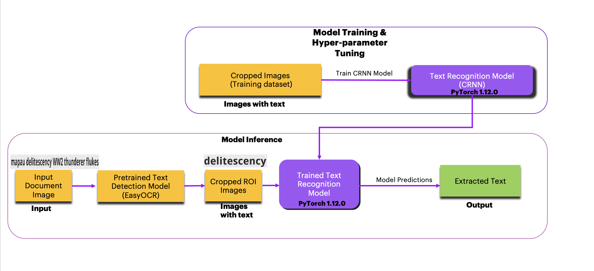
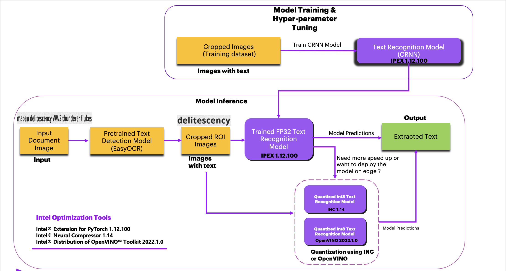
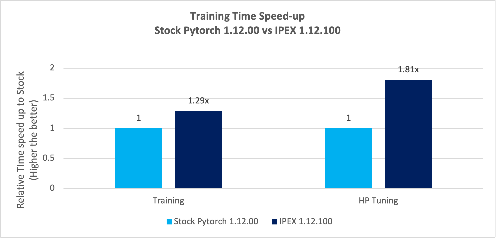
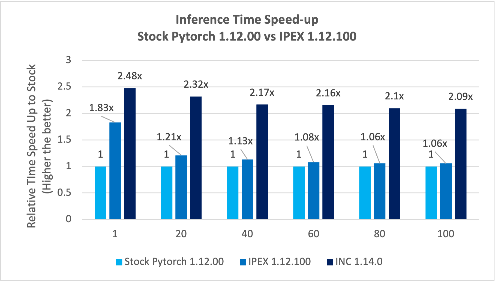
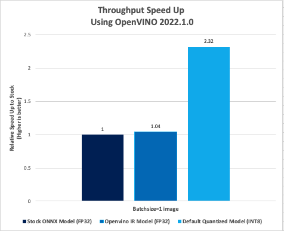

# **PyTorch Historical Assets Document Processing(OCR)**

## Introduction
Utilities are accustomed to working with disconnected, antiquated systems and manual processes. Over the years, the amount of documentation has 
increased substantially and accordingly paper base because many systems cannot accommodate the high volume of engineering data. 
On average, maintenance, engineers, and operations teams spend hours every day, more than one workday each week, searching for accurate 
and up-to-date engineering information, reading through paper-based engineering documents, and maintenance jobs. By providing data-driven 
insights of the assets, AI-powered Intelligent document processing solutions can extend the useful lifetime by several years, minimizing 
service disruptions and reducing operational costs.

OCR (Optical Character Recognition) is used to automatically scan document images, identify the regions of interest (ROIs) with text 
and extract the different letters from the ​text detected.

## **Table of Contents**
 - [Purpose](#purpose)
 - [Reference Solution](#proposed-solution)
 - [Reference Implementation](#reference-implementation)
 - [Intel® Implementation](#optimizing-the-E2E-solution-with-Intel®-oneAPI)
 - [Performance Observations](#performance-observations)

## Purpose
Intelligent document processing requires the processing of structured, semi-structured,  and unstructured content in documents. This requires image preprocessing, analysis, text region detection and text extraction using OCR and 
entities recognition using NLP techniques. OCR (Optical Character Recognition) is used to automatically scan document images, identify the 
regions with text and extract the different letters from the ​text detected. As an industry solution, the scanned input document image can be passed through any text detector (like Keras OCR)
and then the extracted ROIs containing texts are sent to the Text Extraction module (CRNN architecture) from which 
the text can be extracted and entities like Date, time, price, address, etc. can be detected as per the specific use case.

## Reference Solution
In this reference kit, we are building a deep learning model to perform text extraction from documents. We also focus on the following critical factors
- Faster model development
- Performance efficient model inference and deployment mechanism.

In a typical deep learning based OCR solution, pretrained text detection model gives good accuracy on detecting text regions in the images but text recognition model is generally finetuned on the given dataset. Accuracy of text recognition model is dependent on the different properties of text like font, font-size, font color and handwritten or printed text etc. Hence it is advised to finetune the text recognition model on given dataset instead of using pretrained model to observe more accuracy in OCR pipeline. For this reference kit, in the end to end ocr pipeline, we are using pretrained text detection model from EasyOCR python library (installation steps can be found in this link https://pypi.org/project/easyocr), to detect the region of interest (ROIs) in the input image. These ROIs are cropped from the input image and passed to the trained text recognition (CRNN) model. We have focused only on training and inference of the text recognition component only.

For text recognition, we use CRNN, a classical convolutional recurrent neural network. CRNN model is the most widely used for text recognition. Tuning parameters have been introduced to the model in an optimization algorithm with different learning rates for checking how quickly the model is adapted to the problem in order to increase the model performance.

Since GPUs are the natural choice for deep learning and AI processing to achieve a higher FPS rate but are very expensive and memory-consuming, the experiment applies model quantization using Intel's technology, which compresses the model using quantization techniques and uses the CPU for processing while maintaining the accuracy and speeding up the inference time of text extraction from documents.

Finally, we highlight the difference between using Intel® OneAPI packages against a stock version of the same packages. The time required for training the model, inference time and the accuracy of model are captured for multiple runs on the stock version as well on the Intel OneAPI version. The average of these runs is considered and the comparison is provided.

### **Key Implementation Details**

The reference kit implementation is a reference solution to the OCR text extraction use case that includes 

  1. A reference E2E architecture to arrive at an AI solution with CRNN (Convolutional Recurrent Neural Network) for text extraction
  from documents.
  2. An Optimized reference E2E architecture enabled with Intel® Extension for PyTorch 1.12.100 and Intel® Neural Compressor 1.14
  3. Intel® Distribution of OpenVINO™ 2022.1.0 Implementation

## **Reference Implementation**

### **Use Case E2E flow**



### Expected Input-Output

**Input**                                 | **Output** |
| :---: | :---: |
| Image with text          | Extracted text|


### ***Hyperparameter Analysis***

In realistic scenarios, an analyst will run the text extraction model multiple times on the same dataset, scanning across different hyperparameters.  
To capture this, we measure the total amount of time it takes to generate results across different hyperparameters for a fixed algorithm, which we 
define as hyperparameter analysis.  In practice, the results of each hyperparameter analysis provide the analyst with many different models that 
they can take and further analyze.

The below table provides details about the hyperparameters & values used for hyperparameter tuning in our benchmarking experiments:
| **Algorithm**                     | **Hyperparameters**
| :---                              | :---
| CRNN Architecture                 | learning rate, epochs, batch size

 We introduced different learning rates and batch sizes to the model architecture on the dataset, we increased the number of epochs to reach maximum accuracy on the training set. Hyperparameters considered for tuning are `Learning Rate, Epochs, Batch Size`.

### ***Software Requirements***
1. Python - 3.9.13
2. PyTorch - 1.12.0

### ***Solution Setup Prerequisite***
> Note that this reference kit implementation already provides the necessary scripts to setup the software requirements. 
To utilize these environment scripts, first install Anaconda/Miniconda by following the instructions at the following link https://docs.conda.io/projects/conda/en/latest/user-guide/install/index.html or [Anaconda installation](https://docs.anaconda.com/anaconda/install/linux/)

### ***Solution setup***
Clone the repository to desired location on your computes using the command given below:
```sh
git clone https://github.com/oneapi-src/historical-assets-document-process.git
cd historical-assets-document-process
```
### Dataset
| **Use case** | OCR Text Extraction
| :--- | :---
| **Dataset** | Synthetic Random Words Dataset
| **Size** | Total 3356 Labelled Images<br>
| **Train Images** | 3256
| **Test Images** | 100
| **Input Size** | 32x280

The dataset used for this demo is a synthetic dataset generated using TextRecognitionDataGenerator package (https://github.com/Belval/TextRecognitionDataGenerator). In this dataset, each image has certain texts in it. The ground truth text file is created with each image path and its respective words in the image. (Since we are using this dataset for Text extraction use case).
The synthetic dataset can be generated using below steps:
  ```
  conda env create -f env/data_gen/ocr-datagen.yml
  conda activate ocr-datagen
  sh src/dataset_gen.sh
  conda deactivate
  ```

> After running above steps, dataset will be generated in the data folder. Dataset contains train.txt, test.txt and images in data/dataset folder. train.txt and test.txt files will be used for training and inference respectively. These files contain paths to images and their respective labels.

>Note: It is assumed that the present working directory is the root directory of this code repository. You can verify the present working directory location using following command.
```sh
$pwd
```
```
output: 
<Absolute local path to cloned directory>/historical-assets-document-process
```
Follow the below conda installation commands to setup the Stock enviroment along with the necessary packages for this model training and prediction.
```
conda env create --file env/stock/stock-ocr.yml
```
This command utilizes the dependencies found in the `env/stock/stock.yml` file to create an environment as follows:

**YAML file**                       | **Environment Name**         |  **Configuration** |
| :---: | :---: | :---: |
| `env/stock/stock-ocr.yml`             | `stock-ocr` | Python=3.9.13 with PyTorch=1.12.0

Use the following command to activate the environment that was created:
*Activate stock conda environment*
```sh
conda activate stock-ocr
```

### **Reference Sources**
*Case Study* *Github repo*: https://github.com/courao/ocr.pytorch.git<br>

### ***Solution implementation***

#### **Model building process**
#### **Model Training**
The Python script given below needs to be executed to start training using the active environment enabled by using 
the above steps to setup the environment. 

Pretrained text recognition (CRNN) model CRNN-1010.pth needs to be downloaded from https://drive.google.com/drive/folders/1hRr9v9ky4VGygToFjLD9Cd-9xan43qID. The below command can be used to download the model.
```
wget --no-check-certificate 'https://docs.google.com/uc?export=download&id=15TNHcvzNIjxCnoURkK1RGqe0m3uQAYxM' -O CRNN-1010.pth
mkdir ./src/crnn_models
mv CRNN-1010.pth ./src/crnn_models/CRNN-1010.pth
```

```
usage: python src/ocr_train.py [-p ][-i ][-b ][-m ]
```
Arguments:<br>
```
--model_prefix, -p	  give prefix for model generated after training
--intel, -i               1 for enabling Intel PyTorch Optimizations, default is 0
--batchsize, -b           give the required batch size
--model_path, -m          give the path for the pretrained Model
```

<b>Example</b>: 
```
python src/ocr_train.py -p "CRNN-1010_Stock_WOHP" -b 80 -m src/crnn_models/CRNN-1010.pth
```
In this example, as the environment is stock environment, -i parameter is not given and takes the default value of 0, batch size is 80, the model generated will be saved in ./src/crnn_models folder with the prefix CRNN-1010_Stock_WOHP.

#### **Hyperparameter Tuning**
The Python script given below needs to be executed to start hyperparameter tuned training using the active environment enabled by using the above steps to 
setup the environment. 

The model generated using regular training from previous steps will be used as the pretrained model. Hyperparameters considered for tuning are 
learning rate, epochs and the batch size. The model generated is saved to ./src/crnn_models folder.

```
usage: python src/ocr_train_hp.py [-p ][-i ][-b ][-m ]
```

Arguments:<br>
```
--model_prefix, -p        give prefix for model generated after training
--intel, -i               1 for enabling Intel PyTorch Optimizations, default is 0
--batchsize, -b           give the required batch size
--model_path, -m          give the path for the pretrained Model
```

<b>Example</b>: 
```sh
python src/ocr_train_hp.py -p "CRNN-1010_Stock_WHP" -b 80 -m src/crnn_models/CRNN-1010_Stock_WOHP_best_870.pth
```
In this example, as the environment is stock environment, -i parameter is not given and takes the default value of 0, batch size is 80, the model gets tuned with hyperparameters and the generated model will be saved in ./src/crnn_models folder with the prefix CRNN-1010_Stock_WHP.

#### Model Inference or Predictions
The Python script given below needs to be executed to perform inference using any of the models generated in the above steps. The paths of images, for 
which the inference has to be performed need to be given in test.txt. The number of paths of images given in the file will be the batch size for 
performing inference. In case of real time inference, only one image path needs to be provided.

```
usage: python src/inference.py [-i ][-m ][-b]
```

Arguments:<br>
```
  -i, --intel               Give 1 for enabling intel pytorch optimizations, default is 0
  -m, --model_path          Absolute path to the pytorch model with extension ".pth"
  -b, --batchsize           batchsize of images
```

<b>Example</b>:
```sh
python src/inference.py -m "./src/crnn_models/CRNN-1010_Stock_WOHP_best_870.pth" -b 100
```
In this example, "./src/crnn_models/CRNN-1010_Stock_WOHP_best_870.pth" is the trained model used for inference and default of 0 (for stock environment)
will be considered for --i. The script does the inference for the set of images given in test.txt and outputs the Inference
time for processing the images.

#### End to End Inference Pipeline
The Python script given below needs to be executed to perform end to end inference on an input document image using any of the models generated in the above steps. This pipeline will extract all the text from the given input document image.

```
usage: python src/ocr_pipeline.py [-i ][-p ][-q][-m][-n]
```

Arguments:<br>
```
  -i, --intel                   Give 1 for enabling intel pytorch optimizations, default is 0
  -q, --inc                     Give 1 for enabling INC quantized model for inferencing, default is 0
  -m, --crnn_model_path         Path to the CRNN FP32 model
  -n, --quantized_model_path    Path to the CRNN Int8 model, it must be given if -q parameter is set to True, default is None
  -p, --test_dataset_path       Path to the test image directory 
```

<b>Example</b>:
```sh
python src/ocr_pipeline.py -p data/pipeline_test_images -m src/crnn_models/CRNN-1010.pth
```
The script does the inference on the set of input document images given in ./data/pipeline_test_images. Extracted text output
will be saved in ./test_result folder.

## **Optimizing the E2E solution with Intel® Extension for PyTorch**
Although AI delivers a solution to address text extraction, a production scale implementation with millions 
or billions of records demands for more compute power without leaving any performance on the table. Under this scenario, 
text extraction models are essential for identifying and extracting text which will enable analysts to take
appropriate decisions. For example, printed invoices can be used to identifying and extracting text, the results of 
extraction can be later used for multiple purposes. In order to derive the most insightful and beneficial actions to take, 
they will need to study and analyze the data generated through various feature sets and algorithms, thus requiring frequent 
re-runs of the algorithms under many different parameter sets. To utilize all the hardware resources efficiently, Software 
optimizations cannot be ignored.   
 
This reference kit solution extends to demonstrate the advantages of using the Intel® AI Analytics Toolkit on the task of 
building a model for text extractions from documents.  The savings gained from using the Intel® Extension for PyTorch can 
lead an analyst to more efficiently explore and understand data, leading to better and more precise targeted solutions.

#### Use Case E2E flow


### **Optimized software components**
Intel® Extension for PyTorch (version 1.12.100) framework has been optimized using oneAPI Deep Neural Network Library (oneDNN) primitives, a popular performance 
library for deep learning applications. It provides accelerated implementations of numerous popular DL algorithms that optimize performance on 
Intel® hardware with only requiring a few simple lines of modifications to existing code.

Intel® Neural Compressor (version 1.14.0) is an open-source Python library. ML developers can incorporate this library for quantizing 
the deep learning models. The quantized models give the advantage of compressing the models and boost in performance for inference time.​

### ***Software Requirements***
| **Package**                       | **Intel® Python**
| :---                              | :---
| Python                            | 3.9.13
| Intel® Extension for PyTorch      | 1.12.100
| Intel® Neural Compressor          | 1.14

### ***Optimized Solution setup***
Follow the below conda installation commands to setup the Intel enviroment along with the necessary packages for model training and prediction.
>Note: It is assumed that the present working directory is the root directory of this code repository

```shell
conda env create --file env/intel/intel-ocr.yml
```
This command utilizes the dependencies found in the `env/intel/intel.yml` file to create an environment as follows:

**YAML file**                                 | **Environment Name** |  **Configuration** |
| :---: | :---: | :---: |
| `env/intel/intel-ocr.yml`             | `intel-ocr` | Python=3.9.13 with Intel PyTorch Extension 1.12.100

For the workload implementation to arrive at first level solution we will be using the intel environment

Use the following command to activate the environment that was created:
```shell
conda activate intel-ocr
```
The below changes have been done to the stock PyTorch training code base to utilize the Intel® Extension for PyTorch* performance.
One can enable the intel flag to incorporate below Intel Pytorch optimizations.
```python
import intel_extension_for_pytorch as ipex

model, optimizer = ipex.optimize(crnn, optimizer = optimizer)
```

### ***Optimized Solution implementation***

#### **Optimized Model building process**
#### **Regular Model Training
The Python script given below needs to be executed to start training using the active environment enabled by using 
the above steps to setup the environment. 

```
usage: python src/ocr_train.py [-p ][-i ][-b ][-m ]
```
Arguments:<br>
```
--model_prefix, -p        give prefix for model generated after training
--intel, -i               1 for enabling Intel PyTorch Optimizations, default is 0
--batchsize, -B           give the required batch size
--model_path, -m          give the path for the pretrained Model 
```

<b>Example</b>: 
```sh
python src/ocr_train.py -p "CRNN-1010_Intel_WOHP" -i 1 -b 80 -m src/crnn_models/CRNN-1010.pth
```
In this example, as the environment is with Intel Optimizations, -i is set to 1, batch size is 80, the model generated will be saved in ./src/crnn_models folder with the prefix CRNN-1010_Intel_WOHP.

#### **Hyperparameter Tuning**
The Python script given below needs to be executed to start hyperparameter tuned training using the active environment enabled by using the above steps to 
setup the environment. 

The model generated using regular training from previous steps will be used as the pretrained model. Hyperparameters considered for tuning are 
learning rate, epochs and batch size. The model generated is saved to ./src/crnn_models folder.

```
usage: python src/ocr_train_hp.py [-p ][-i ][-b ][-m ]
```

Arguments:<br>
```
--model_prefix, -p        give prefix for model generated after training
--intel, -i               1 for enabling Intel PyTorch Optimizations, default is 0
--batchsize, -b           give the required batch size
--model_path, -m          give the path for the pretrained Model 
--model_path, -m          give the path for the pretrained Model 
```

<b>Example</b>: 
```sh
python src/ocr_train_hp.py -p "CRNN-1010_Intel_WHP" -i 1 -b 80 -m src/crnn_models/CRNN-1010_Intel_WOHP_best_870.pth
```
In this example, as the environment is intel, -i parameter is set to 1, batch size is 80, the model gets tuned with hyperparameters and the generated model will be saved in ./src/crnn_models folder with the prefix CRNN-1010_Intel_WHP.

#### **Optimized Model Inference or Predictions**
The Python script given below needs to be executed to perform inference using any of the models generated in the above steps. The paths of images, for 
which the inference has to be performed need to be given in test.txt. The number of paths of images given in the file will be the batch size for 
performing inference. In case of real time inference, only one image path needs to be provided.

```
usage: python src/inference.py [-i ][-m ][-b]
```

Arguments:<br>
```
  -i, --intel               Give 1 for enabling intel pytorch optimizations, default is 0
  -m, --model_path          Absolute path to the pytorch model with extension ".pth"
  -b, --batchsize           batchsize of input images
```

<b>Example</b>:
```sh
python src/inference.py -i 1 -m ./src/crnn_models/CRNN-1010_Intel_WOHP_best_870.pth -b 100
```
In this example, -i is set to 1 because the environment is Intel Optimized environment. The "./src/crnn_models/CRNN-1010_Intel_WOHP_best_870.pth" is the trained model used 
for inference. The script does the inference for the set of images given in test.txt and logs the inference
time as output.

#### End to End Inference Pipeline
The Python script given below needs to be executed to perform end to end inference on an input document image using any of the models generated in the above steps. This pipeline will extract all the text from the given input document image.
```
usage: python src/ocr_pipeline.py [-i ][-p ][-q][-m][-n]
```

Arguments:<br>
```
  -i, --intel                   Give 1 for enabling intel pytorch optimizations, default is 0
  -q, --inc                     Give 1 for enabling INC quantized model for inferencing, default is 0
  -m, --crnn_model_path         Path to the CRNN FP32 model
  -n, --quantized_model_path    Path to the CRNN Int8 model, it must be given if -q parameter is set to True, default is None
  -p, --test_dataset_path       Path to the test image directory 
```

<b>Example</b>:
```sh
python src/ocr_pipeline.py -i 1 -p data/pipeline_test_images -m src/crnn_models/CRNN-1010.pth
```
The script does the inference on the set of input document images given in ./data/pipeline_test_images. Extracted text output
will be saved in ./test_result folder. Intel flag has been set to true to enable the Intel optimizations while inference.

#### **Quantization with Intel Neural Compressor**
Intel® Neural Compressor is used to quantize the FP32 Model to the INT8 Model.
Intel® Neural Compressor supports many optimization methods. Here, we have used post training quantization with `Default quanitization mode` method to 
quantize the FP32 model.

The below script is used to convert the FP32 model to INT8 quantized model. Run the below script after activating the Intel environment.
```
usage: python src/neural_compressor_conversion.py [-m MODELPATH] [-o OUTPUTPATH]
```

Arguments:
```
  -m, --modelpath                 path of the FP32 model
  -o, --outputpath           output path for int8 model

```

<b>Example</b>
```sh
python src/neural_compressor_conversion.py -m ./src/crnn_models/CRNN-1010_Intel_WHP_best_820.pth -o src/crnn_models
```
Here the "./src/crnn_models/CRNN-1010_Intel_WHP_best_820.pth" gives the path of the FP32 trained model. The model after conversion, that is 
the quantized model will be stored in the src/crnn_models folder.

#### **Inference with Quantized Model**
The Python script given below needs to be executed to perform inference using the model generated in the above step. The paths of images, for 
which the inference has to be performed need to be given in test.txt. The number of paths of images given in the file will be the batch size for 
performing inference. In case of real time inference, only one image path needs to be provided.

```
usage: python src/inc_inference.py [-m FP32MODELPATH] [-q INT8MODELPATH] [-b batchsize]
```
Arguments:
```
  -m, --fp32modelpath             FP32 model 
  -q, --int8modelpath             quantized model
  -b, --batchsize                 batchsize of input images
```

<b>Example</b>
```sh
python src/inc_inference.py -m ./src/crnn_models/CRNN-1010_Intel_WHP_best_820.pth  -q ./src/crnn_models/best_model.pt -b 100
```
To analyse the performance of the FP32 and INT8 models we can use the below script

```
usage: python src/performance_analysis.py [-m FP32MODELPATH] [-q INT8MODELPATH]
```
By running the above script we can get the time taken for both the FP32 model and INT8 model which can be used for comparison.

Arguments:
```
  -m, --fp32modelpath             FP32 model 
  -q, --int8modelpath             quantized model
```
<b>Example</b>
```sh
python src/performance_analysis.py -m ./src/crnn_models/CRNN-1010_Intel_WHP_best_820.pth  -q ./src/crnn_models/best_model.pt
```

#### End to End Inference Pipeline
The Python script given below needs to be executed to perform end to end inference on an input document image using the quantized model generated in the above steps. This pipeline will extract all the text from the given input document image.
```
usage: python src/ocr_pipeline.py [-i ][-p ][-q][-m][-n]
```

Arguments:<br>
```
  -i, --intel                   Give 1 for enabling intel pytorch optimizations, default is 0
  -q, --inc                     Give 1 for enabling INC quantized model for inferencing, default is 0
  -m, --crnn_model_path         Path to the CRNN FP32 model
  -n, --quantized_model_path    Path to the CRNN Int8 model, it must be given if -q parameter is set to True, default is None
  -p, --test_dataset_path       Path to the test image directory 
```

<b>Example</b>:
```sh
python src/ocr_pipeline.py -i 1 -q 1 -p data/pipeline_test_images -m src/crnn_models/CRNN-1010.pth -n src/crnn_models/best_model.pt 
```
In this example, "./src/crnn_models/CRNN-1010.pth" is the trained FP32 model and src/crnn_models/best_model.pt is the quantized int8 model used for inference. The script does the inference on the set of input document images given in ./data/pipeline_test_images. Extracted text output
will be saved in ./test_result folder. INC flag has been set to true to enable inference using quantized int8 model.

### **Using Intel® Distribution of OpenVINO™**
When it comes to the deployment of this model on Edge devices, with less computing and memory resources, we further need to explore 
options for quantizing and compressing the model which brings out the same level of accuracy and efficient utilization of underlying 
computing resources. Intel® Distribution of OpenVINO™ Toolkit facilitates the optimization of a deep learning model from a framework 
and deployment using an inference engine on such computing platforms based on Intel hardware accelerators. This section covers the steps 
to use this toolkit for model quantization and measure its performance.

### ***Intel® Distribution of OpenVINO™ Environment Setup***
Follow the below conda installation commands to setup the OpenVINO enviroment along with the necessary packages.
>Note: It is assumed that the present working directory is the root directory of this code repository

```shell
conda env create --file env/openvino_pot/openvino-ocr.yml
```
This command utilizes the dependencies found in the `env/openvino_pot/openvino.yml` file to create an environment as follows:

**YAML file**                                 | **Environment Name** |  **Configuration** |
| :---: | :---: | :---: |
| `env/openvino_pot/openvino-ocr.yml`             | `openvino-ocr` | 2022.1.0

Use the following command to activate the environment that was created:
```shell
conda activate openvino-ocr
```

#### Model conversion to OpenVINO Intermediate Representation (IR) conversion
Below script is used to convert FP32 model to ONNX model representation. The converted onnx model file will be saved in 
./src/openvino.

```
  python src/onnx_convert.py -m [FP32ModelPath] -output [output dir path to save the onnx model]
```

Arguments:
```
  -m, --fp32modelpath             FP32 model Path
  -output, --onnxmodelpath        give path in which you want the ONNX model to be stored
```

<b>Example</b>
```sh
python src/onnx_convert.py -m src/crnn_models/CRNN-1010_Intel_WHP_best_900.pth -output src/openvino
```
The converted model will be saved to the src/openvino folder in .onnx format.

Below command is used to convert the onnx model to OpenVINO IR model format.
```sh
mo --input_model <onnx model> --output_dir <output dir path to save the IR model>
```
Arguments
```
--input_model     onnx model
--output_dir      path of the folder to save the OpenVINO IR model format
```
The above command will generate `<model-name>.bin` and `<model-name>.xml` as output which can be used for OpenVINO inference. Default precision is FP32.\
\
<b>Example</b>
```sh
mo --input_model ./src/openvino/test_model.onnx --output_dir ./src/openvino
```

#### Model Performance with OpenVINO Post-Training Optimization Tool
Post-training Optimization Tool (POT) is designed to accelerate the inference of deep learning models by applying special methods without model 
retraining or fine-tuning. One such method is post-training quantization.

Below command is used to run the benchmark tool for the ONNX model generated. 

```sh
benchmark_app -m <path of onnx model>
```

Argument
```
-m,--modelpath   path of model in onnx format
```
<b>Example</b>
```sh
benchmark_app -m ./src/openvino/test_model.onnx
```

Below command is used to run the benchmark tool for the OpenVINO IR model. 
```sh
benchmark_app -m <Path of the OpenVino IR model in xml format>
```
Argument
```
-m,--modelpath   Path of model in OpenVino IR model in xml format
```
<b>Example</b>
```sh
benchmark_app -m ./src/openvino/test_model.xml
```
#### Model Conversion Using OpenVino Quantization
A configuration file is needed to configure the various parameters for post training optimization tool (pot). The same configuration file has already been provided in the repo at follwing path: 
```
src/openvino/OCR_model_int8.json
```

User can update the following parameters in the json file using any editor tool available on the computer.
```
"model_name"    : Name of the output model
"model"         : path to fp32 model (.xml) file
"weights"       : path to fp32 model weights (.bin) file
```
Use the below command to quantize the model. When this command execution completes successfully, it generates a 
folder with the name `results` where the quantized model files will be generated.
```sh
cd src/openvino
pot -c <path of the configuration file> -d 
```
Argument
```
-c,--configfile  path of the POT configuration file
```
<b>Example</b>
```sh
cd src/openvino
pot -c OCR_model_int8.json -d
```
After running the above command, we can verify that "OCR_model.bin", "OCR_model.xml", "OCR_model.mapping" files (quantized model) got generated on "src/openvino/results/optimized" path.
##### Model Performance Using Quantized (INT8) Model
Use the below command to run the benchmark tool for the Quantized OpenVINO IR model.

```sh
benchmark_app -m <quantized POT model in xml format>
```

Argument
```
-m,--quantizedmodelpath   Quantized POT model in xml format
```
<b>Example</b>
```sh
benchmark_app -m ./results/optimized/OCR_model.xml
```
## **Performance Observations**
This section covers the training time and inference time comparison between Stock PyTorch version and Intel® Extension for PyTorch for this 
model training and prediction. The results are captured for regular training and hyperparamter tuned training models which includes 
training time and inference time. The results are used to calculate the performance gain achieved by using Intel® One API packages over 
stock version of similar packages.


<br>**Takeaway**<br>Intel® Extension for PyTorch offers training time speed-up of around 1.29x during regular model training and 
around 1.81x during hyperparameter tuned training compared to stock PyTorch version.


<br>**Takeaway**<br>Intel® Extension for PyTorch* 1.12.100 offers real time inference speed-up of around 1.83x gain and batch inference speed-up up to 1.21x gain when compared to stock PyTorch 1.12.0.

Intel® Neural Compressor 1.14.0 quantization offers real time inference speed-up of around 2.48x gain and batch inference speed-up up to 2.32x gain when compared to stock PyTorch 1.12.0.



- Full precision ONNX Model (FP32)
    - Throughput: **272.93 FPS**
- Full precision IR Model (FP32)
    - Throughput: **275.13 FPS**
- Quantized IR Model (INT8 with DefaultQuantization)
    - Throughput: **635.25 FPS**

<br>**Takeaway**<br>Intel® Distribution of OpenVINO™ full precision IR (FP32) model offers FPS speed-up of around 1x and quantized IR (INT8) model with default quantization
offers FPS speed-up of 2.32x compared to full precision ONNX model.

#### **Conclusion**
To build an OCR text extraction solution using CRNN (Convolutional Recurrent Neural Network) transfer learning approach, 
at scale, Data Scientists will need to train models for substantial datasets and run inference more frequently. The ability 
to accelerate training will allow them to train more frequently and achieve better accuracy. Besides training, faster speed 
in inference will allow them to run prediction in real-time scenarios as well as more frequently. A Data Scientist will also 
look at text extraction from documents and categorize them so that it can be better understood and analyzed. This task requires 
a lot of training and retraining, making the job tedious. The ability to get it to faster speed will accelerate the ML pipeline. 
This reference kit implementation provides performance-optimized guide around named OCR text extraction use cases that can be 
easily scaled across similar use cases.

###Notices & Disclaimers
Performance varies by use, configuration, and other factors. Learn more on the [Performance Index site](https://edc.intel.com/content/www/us/en/products/performance/benchmarks/overview/). 
Performance results are based on testing as of dates shown in configurations and may not reflect all publicly available updates.  See backup for configuration details.  No product or component can be absolutely secure. 
Your costs and results may vary. 
Intel technologies may require enabled hardware, software, or service activation.<br>
© Intel Corporation.  Intel, the Intel logo, and other Intel marks are trademarks of Intel Corporation or its subsidiaries.  Other names and brands may be claimed as the property of others.

## Appendix

### **Running on Windows**

The reference kits commands are linux based, in order to run this on Windows, goto Start and open WSL and follow the same steps as running on a linux machine starting from git clone instructions. If WSL is not installed you can [install WSL](https://learn.microsoft.com/en-us/windows/wsl/install).

> **Note** If WSL is installed and not opening, goto Start ---> Turn Windows feature on or off and make sure Windows Subsystem for Linux is checked. Restart the system after enabling it for the changes to reflect.
****

### **Experiment setup**

| Platform                          | Ubuntu 20.04
| :---                              | :---
| Hardware                          | Azure Standard_D8_V5
| Software                          | Intel® Distribution for Python 3.9, Intel® Extension for PyTorch 1.12.100, Intel® Neural Compressor 1.14.0, Intel® Distribution of OpenVINO™ Toolkit 2022.1.0.
| What you will learn               | Advantage of using components in Intel® Extension for PyTorch over the stock versions.

