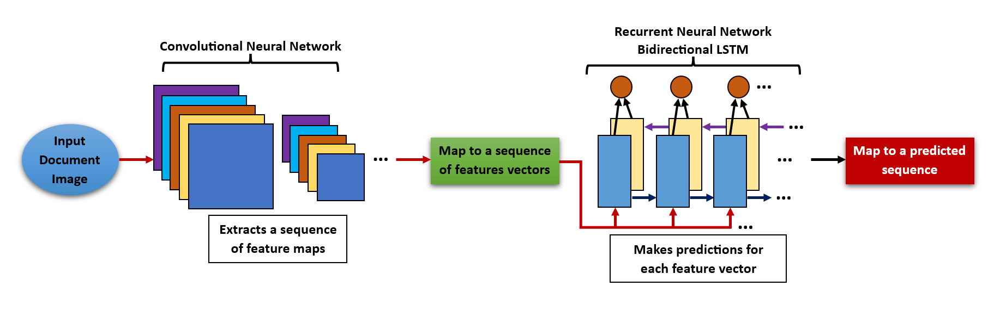
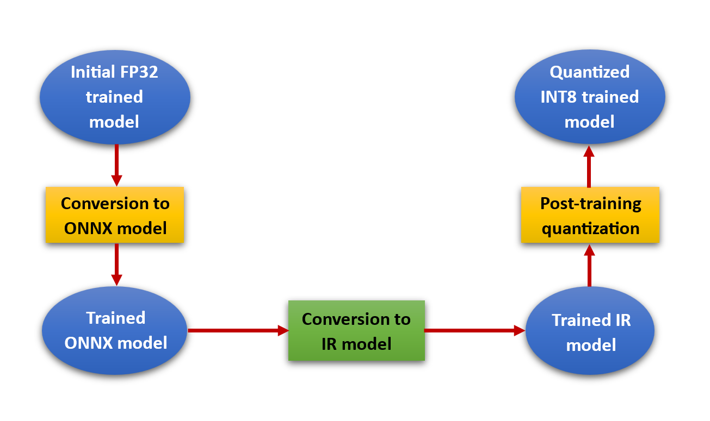

# PyTorch Historical Assets Document Processing(OCR)

## Introduction

Build an optimized Optical Character Recognition (OCR) solution to automate text detection and extraction from input document images using Intel® Extension for PyTorch\*, Intel® Neural Compressor and Intel® Distribution of OpenVINO<sup>TM</sup> Toolkit. Check out the [Developer Catalog](https://developer.intel.com/aireferenceimplementations) for information about different use cases.

## Solution Technical Overview
Historically, business and organizations have faced the need to manage a huge amount of printed documents for multiple purposes, like obtain customer’s credit history, collect medical history of patients or access to legal documents for judicial cases. Manually process this enormous flow of paper-based documents represents a big challenge for any industry, since this manual procedure takes a lot of time to carry out, is prone to human error/bias, and requires a considerable physical space to store hundreds or thousands of paper files.

The issue related to using storage facilities to preserve the documents can be address by a paperless and digitized solution that offers a way to easily store the printed documents in a suitable database. However, having a document scanned into an image of text is different than a machine-encoded text, which allows, for example, to efficiently use a text editor to modify some old file or retrieve a document by searching for a specific entity in a database, like client’s name. In this context, a large set of scanned files still requires domain specialization to manually extract useful information, which involves time, increases the cost of the process, and cannot eradicate the potential intentional or unintentional errors due to human intervention.

Optical Character Recognition (OCR) systems emerge as an automated solution that generates machine-encoded text from input document images, making more efficient the processing of an increasingly number of digital files, in addition to minimizing human intervention [[1]](#hegghammer_2021)[[2]](#li_2022).

In an OCR pipeline, an input document image flows into a text detection component and next, it is processed by a text recognition component. In the text detection stage, the objective is to localize all text regions within the input document images, where each of these text zones are known as region of interest (ROI). Once the ROIs are detected, they are cropped from the input images and passed to the text recognition component, which is in charge of identifying the text contained in the ROIs and transcribe such text into machine-encoded text. This process is illustrated in the following diagram:


Nowadays, AI (Artificial Intelligence) methods in the form of cutting-edge deep learning algorithms are commonly incorporated into OCR solutions to increase their efficiency in the processing of scanned files and their accuracy in the text recognition task [[3]](#memon_2020). Deep learning detection models like YOLO variations and CRAFT are frequently used in the text detection module to localize the ROIs, whereas models like Convolutional Recurrent Neural Networks (CRNN) and Transformers are implemented as part of the text recognition stage [[2]](#li_2022)[[4]](#faustomorales_2019).

Although deep learning-based OCR systems deliver a solution to effectively recognize and extract text images, in a production environment, where a massive number of digitized documents may query an OCR engine, it becomes essential to scale compute resources while maintaining the accuracy and speeding up the inference time of text extraction from document images.

This reference kit presents an OCR solution that features deep learning models for the text detection and recognition stages. For the text detection process, a Python\* library called EasyOCR is used. In the case of the text recognition stage, a CRNN architecture is implemented. Even though both detection and recognition components are contained in the proposed OCR pipeline, it is very important to note that this OCR solution mainly focuses on the training and inference stages of the text recognition module. For more details about the text recognition component, please refer to [this section](#solution-technical-details).

Besides offering an OCR system based on state-of-the-art deep learning techniques, the proposed OCR solution also considers the scale demands for a production environment by boosting the performance of the text recognition component using the following Intel® packages:

* ***Intel® Extension for PyTorch****

  With a few lines of code, you can use [Intel® Extension for PyTorch*](https://www.intel.com/content/www/us/en/developer/tools/oneapi/optimization-for-pytorch.html#gs.5vjhbw) to:
    * Take advantage of the most up-to-date Intel software and hardware optimizations for PyTorch.
    * Automatically mix different precision data types to reduce the model size and computational workload for inference.
    * Add your own performance customizations using APIs.

* ***Intel® Neural Compressor***

  [Intel® Neural Compressor](https://www.intel.com/content/www/us/en/developer/tools/oneapi/neural-compressor.html#gs.5vjr1p) performs model compression to reduce the model size and increase the speed of deep learning inference for deployment on CPUs or GPUs. This open source Python* library automates popular model compression technologies, such as quantization, pruning, and knowledge distillation across multiple deep learning frameworks.

* ***Intel® Distribution of OpenVINO<sup>TM</sup>* Toolkit***

  The [OpenVINO<sup>TM</sup>](https://www.intel.com/content/www/us/en/download/753640/intel-distribution-of-openvino-toolkit.html) toolkit:
     * Enables the use of models trained with popular frameworks, such as TensorFlow* and PyTorch*.
     * Optimizes inference of deep learning models by applying model retraining or fine-tuning, like post-training quantization. 
     * Supports heterogeneous execution across Intel hardware, using a common API for the Intel CPU, Intel® Integrated Graphics, Intel® Discrete Graphics, and other commonly used accelerators. 

In particular, Intel® Neural Compressor functionalities are applied to compress the CRNN text extraction model via a post-training quantization procedure, which improves the performance of the model in inference time without compromising its accuracy and supports an efficient deployment of the quantized model in a wide range of Intel® CPUs and GPUs. In the same way, Intel® Distribution of OpenVINO<sup>TM</sup> Toolkit reduces model size by using quantization techniques, but also features an optimized deployment across Intel platforms, including edge devices and cloud environments. A detailed description of how this reference kit implements Intel® optimization packages can be found in this [section](#how-it-works).

With the aim to provide an accessible approach to conduct frequent re-training to analyze the performance of multiple CRNN models for the text extraction component, this OCR solution enables hyperparameter tuning. Combined with the use of cutting-edge deep learning models and Intel® optimization packages, hyperparameter tuning makes possible to leverage this reference kit as a useful resource for the machine learning practitioner looking to easily build and deploy a custom OCR system optimized to accurately extract text within document images.

Furthermore, avoiding the manual retrieval of some specific information from a myriad of paper-based files and drastically reducing the human bias in the process, this reference kit presents an OCR system that the machine learning practitioner can leverage to perform text extraction for multiple applications, including [[5]](#thompson_2016)[[6]](#shatri_2020)[[7]](#oucheikh_2022)[[8]](#arvindrao_2023):
  * Preservation of data contained in historical texts dating back centuries.
  * Recognition of musical notation within scanned sheet music.
  * Extracting text information from products to reduce shrinkage loss in grocery stores.
  * Automate the processing of financial documents to combat fraud, increase productivity and improve customer service.  

For more details, visit [Intel® Extension for PyTorch\*](https://www.intel.com/content/www/us/en/developer/tools/oneapi/optimization-for-pytorch.html#gs.5vjhbw), [Intel® Neural Compressor](https://www.intel.com/content/www/us/en/developer/tools/oneapi/neural-compressor.html#gs.5vjr1p), [Intel® Distribution of OpenVINO<sup>TM</sup> Toolkit](https://www.intel.com/content/www/us/en/download/753640/intel-distribution-of-openvino-toolkit.html), the [PyTorch\* Historical Assets Document Processing (OCR)]() GitHub repository, and the [EasyOCR](https://github.com/JaidedAI/EasyOCR) GitHub repository.

## Solution Technical Details
In this section, the interested reader can find a more in deep explanation about the text recognition component from the proposed OCR solution. A description of the dataset used to perform training and inference is also presented.

### Text Recognition Component
This reference kit is mainly focused on the text recognition component of the OCR workflow. The motivation behind this operation mode is that in a typical OCR system, the deep learning model that performs the text detection is a pretrained model that offers enough generalization capabilities to effectively localize the ROIs in the images dataset of the current task, so the process of finetuning the text detection model in the given dataset can be skipped. As a reference, the finetuning procedure consists of adjusting the weights already learned by the pretrained deep learning model, in order to make them more relevant for the problem at hand [[9]](#chollet_2017). Using the given dataset, this weight adjustment is achieved by training some or all the layers of the deep learning model.

For this reference kit, the text detection task is carried out by EasyOCR, a Python\* library that uses the CRAFT (Character Region Awareness For Text Detection) framework, which incorporates a pretrained large scale convolutional neural network. 

On the other hand, the text recognition component does implement a deep learning model that is finetuned based on the ROIs detected in the given dataset, where this detection stage is firstly performed by EasyOCR. It is advisable to finetune the text recognition model on the given dataset because for a particular text recognition problem, the corresponding text images could exhibit certain font properties or they could come from determined sources, like a scanned ID card or a photo of an old manuscript, where the text could have very specific characteristics. In this scenario, finetuning the recognition model on the given dataset is the appropriate approach to achieve high accuracy on the text recognition task.

For the recognition phase, this reference kit uses a CRNN model to identify text within the document images. A CRNN is a neural network architecture composed of a Convolutional Neural Network (CNN) followed by a certain type of Recurrent Neural Network (RNN), which for this project is a Long-Short Term Memory (LSTM). 

A CNN model is useful to automatically extract sequential hierarchical features (known as feature maps) from each input image, whereas a LSTM, as any RNN, exhibits great proficiency in capturing contextual information within a sequence, in addition to be a type of RNN specialized in capturing long-term dependencies [[10]](#choi_2016)[[11]](#shi_2017). In fact, in the context of an OCR pipeline, the text recognition task is framed as an encoder-decoder problem that leverages a CNN-based encoder for image understanding and an RNN-base decoder for text generation [[2]](#li_2022).

About the LSTM model used by the CRNN in this project, it works under a bidirectional approach. A traditional LSTM is directional and only uses contexts from the past, but for an image-based sequence problem, like the one address in this reference kit, a bidirectional LSTM is more appropriate as contexts containing previous and subsequent data are useful and complementary to each other [[11]](#shi_2017). 

Regarding the workflow process of the CRNN, it receives a cropped ROI image from EasyOCR as an input, and the convolutional component proceeds to extract a sequence of feature maps, which are then mapped into a sequence of feature vectors. Next, the bidirectional LSTM makes a prediction for each feature vector. Finally, a post-processing step is carried out to convert the LSTM predictions into a label sequence. The diagram below provides an illustrative reference of this process.



In terms of model architecture, the CRNN is composed by seven convolutional layers, each of them followed by a max pooling layer. As for the RNN, it is constituted by two bidirectional LSTM layers, each of them followed by a linear layer. The next table summarizes the structure of the CRNN model implemented in this reference kit. "in_maps" stands for "input feature maps", "out_maps" for "output feature maps", "k" for "kernel size", "s" for "stride", "p" for "padding", "in_features" is the size of each input instance and "out_features" is the size of each output instance.

| **Layer** | Setup
| :--- | :---
| **Input** | Input ROI image<br>
| **Convolutional** | in_maps:1, out_maps:64, k:3 X 3, s:(1,1), p:(1,1)
| **Max pooling** | k:2 X 2, s:2
| **Convolutional** | in_maps:64, out_maps:128, k:3 X 3, s:(1,1), p:(1,1)
| **Max pooling** | k:2 X 2, s:2
| **Convolutional** | in_maps:128, out_maps:256, k:3 X 3, s:(1,1), p:(1,1)
| **BatchNormalization** | -
| **Convolutional** | in_maps:256, out_maps:256, k:3 X 3, s:(1,1), p:(1,1)
| **Max pooling** | k:2 X 2, s:(2,1), p:(0,1)
| **Convolutional** | in_maps:256, out_maps:512, k:3 X 3, s:(1,1), p:(1,1)
| **BatchNormalization** | -
| **Convolutional** | in_maps:512, out_maps:512, k:3 X 3, s:(1,1), p:(1,1)
| **Max pooling** | k:2 X 2, s:(2,1), p:(0,1)
| **Convolutional** | in_maps:512, out_maps:512, k:3 X 3, s:(1,1)
| **BatchNormalization** | -
| **Bidirectional LSTM** | hidden state:256
| **Linear** | in_features: 512, out_features:256
| **Bidirectional LSTM** | hidden state:256
| **Linear** | in_features: 512, out_features:5835

Please see this [section](#download-the-crnn-model) to obtain more information on how to download the CRNN model used in this reference kit.

### Dataset
This reference kit uses a synthetic image dataset of 3,356 labelled images created by the package [TextRecognitionDataGenerator](https://github.com/Belval/TextRecognitionDataGenerator). In this dataset, each image has certain text in it, so these images represent the ROIs that will feed the CRNN text recognition model. As a ground truth, TextRecognitionDataGenerator also generates a text file containing the image path and the corresponding text that appears in the image. Also, the dataset is automatically split into training and test sets. The next table describes the main attributes of the dataset.

| **Use case** | OCR Text Extraction
| :--- | :---
| **Size** | Total 3,356 Labelled Images<br>
| **Train Images** | 3,256
| **Test Images** | 100
| **Input Size** | 32x280

To setup this dataset using TextRecognitionDataGenerator, follow the instructions listed [here](#download-the-datasets).

> *The data set used here was generated synthetically. Intel does not own the rights to this data set and does not confer any rights to it.*

## Validated Hardware Details
There are workflow-specific hardware and software setup requirements depending on
how the workflow is run. 

| Recommended Hardware                                            | Precision
| ----------------------------------------------------------------|-
| CPU: Intel® 2th Gen Xeon® Platinum 8280 CPU @ 2.70GHz or higher | FP32, INT8
| RAM: 187 GB                                                     |
| Recommended Free Disk Space: 20 GB or more                      |

Code was tested on Ubuntu\* 22.04 LTS.

## How it Works
The text recognition component enables the training and inference modalities. Furthermore, this reference kit provides the option to incorporate the trained CRNN text recognition model into an end-to-end OCR system to make predictions from a complete document image. All these procedures are optimized using Intel® specialized packages. The next diagram illustrates the workflow of these processes and how the Intel® optimization features are applied in each stage. 


### Intel® Extension for PyTorch\*
Training a CRNN model, and making inference with it, usually represent compute-intensive tasks. To address these requirements and to gain a performance boost on Intel® hardware, in this reference kit the training and inference stages of the CRNN model include the implementation of Intel® Extension for PyTorch\*.

The training step through Intel® Extension for PyTorch\* has two operation modalities:
   1)	Regular training. In this modality, the CRNN text recognition model is finetuned allowing the user to change the batch size. The resulting trained CRNN model is considered as the pretrained model that will be used to apply hyperparameter tuning in the next modality.
   2)	Hyperparameter tuning. For this approach, the pretrained CRNN model from the previous modality is finetuned via the grid search paradigm, which performs an exhaustive search of optimal hyperparameters based on different values for batch size, learning rate and epochs. It is important to state that the values for batch size, learning rate and epochs are defined by default. The following table shows these values.

        | **Hyperparameter** | Values
        | :--- | :---
        | **Batch size** | 80<br>
        | **Number of epochs** | 5, 10
        | **Learning rates** | 1e-3

Regarding the inference phase, any of the trained CRNN models with Intel® Extension for PyTorch\* can be used to conduct inference tests. An additional advantage of this reference kit is that any of the trained CRNN models can be leveraged to make end-to-end predictions based on an input document image.

Another important aspect of the CRNN models trained with Intel® Extension for PyTorch\*, is that these models are trained using a FP32 precision.

### Intel® Neural Compressor
Once the CRNN models have been trained using Intel® Extension for PyTorch\*, their inference efficiency can be accelerated even more by the Intel® Neural Compressor library. This project enables the use of Intel® Neural Compressor to convert any of the trained FP32 CRNN models into an INT8 CRNN model by implementing post-training quantization, which apart from reducing model size, increase the inference speed up. 

Just like any of the trained CRNN models with Intel® Extension for PyTorch\*, the CRNN model quantized with Intel® Neural Compressor can be used to carry out end-to-end predictions.

### Intel® Distribution of OpenVINO™ Toolkit
Similar to Intel® Neural Compressor, Intel® Distribution of OpenVINO™ Toolkit allows to reduce the model size with post-training quantization, which improves inference performance. By using Intel® Distribution of OpenVINO™ Toolkit post-training quantization, the FP32 CRNN model is converted to INT8. Moreover, Intel® Distribution of OpenVINO™ Toolkit optimizes the CRNN model for deployment in resource-constrained environments, like edge devices.

In order to quantize the FP32 CRNN model using Intel® Distribution of OpenVINO™ Toolkit, it is necessary to first convert the original FP32 CRNN model into ONNX (Open Neural Network Exchange) model representation. After the model is converted to ONNX, it must be converted into an Intermediate Representation (IR) format, which is an internal Intel® Distribution of OpenVINO™ Toolkit model representation. Once the CRNN model is in IR format, Intel® Distribution of OpenVINO™ Toolkit directly quantized the IR model via the Post-training Optimization (POT) tool and transforms it into an INT8 model. This conversion stages are illustrated in the following diagram.



Another benefit from using Intel® Distribution of OpenVINO™ Toolkit is that it enables the use of the benchmark Python\* tool, which is a feature that estimates the inference performance of the corresponding deep learning model on supported devices [[12]](#openvino). The estimated inference performance is calculated in terms of latency and throughput. For this use case, the benchmark Python\* tool is applied on the ONNX, IR and quantized INT8 models.

As it can be seen, this reference kit offers the alternative to optimize the inference performance of the CRNN model not just with Intel® Neural Compressor, but also with Intel® Distribution of OpenVINO™ Toolkit.

Please refer to the [Get Started](#get-started) section to see the instructions to implement the training, inference and end-to-end modalities using Intel® Extension for PyTorch\*, Intel® Neural Compressor and Intel® Distribution of OpenVINO™ Toolkit

## Get Started
Start by **defining an environment variable** that will store the workspace path, this can be an existing directory or one to be created in further steps. This ENVVAR will be used for all the commands executed using absolute paths.

[//]: # (capture: baremetal)
```bash
export WORKSPACE=$PWD/historical-assets-document-process
```

Also, it is necessary to define the following environment variables to correctly setup this reference kit

[//]: # (capture: baremetal)
```bash
export DATA_DIR=$WORKSPACE/data
export OUTPUT_DIR=$WORKSPACE/output 
```

**DATA_DIR:** This path will contain all the directories and files required to manage the dataset. 

**OUTPUT_DIR:** This path will contain the multiple outputs generated by the workflow, e.g. FP32 CRNN model and INT8 CRNN model.

### Download the Workflow Repository
Create the workspace directory for the workflow and clone the [PyTorch Historical Assets Document Processing(OCR)]() repository inside it.

[//]: # (capture: baremetal)
```bash
mkdir -p $WORKSPACE && cd $WORKSPACE
```

```bash
git clone https://github.com/intel-innersource/frameworks.ai.platform.sample-apps.historical-assets-document-process.git $WORKSPACE
```

### Set Up Conda
Please follow the instructions below to download and install Miniconda.

1. Download the required Miniconda installer for Linux.
   
   ```bash
   wget https://repo.anaconda.com/miniconda/Miniconda3-latest-Linux-x86_64.sh
   ```

2. Install Miniconda.
   
   ```bash
   bash Miniconda3-latest-Linux-x86_64.sh
   ```

3. Delete Miniconda installer.
   
   ```bash
   rm Miniconda3-latest-Linux-x86_64.sh
   ```

Please visit [Conda Installation on Linux](https://docs.anaconda.com/free/anaconda/install/linux/) for more details. 

### Set Up Environment
Execute the next commands to install and setup libmamba as conda's default solver.

```bash
conda install -n base conda-libmamba-solver
conda config --set solver libmamba
```

| Packages | Version | 
| -------- | ------- |
| python | 3.9 |
| intelpython3_core | 2023.2.0 |
| intel-extension-for-pytorch | 2.0.100 |
| neural-compressor| 2.3 |
| openvino-dev| 2023.1.0 |

The dependencies required to properly execute this workflow can be found in the yml file [$WORKSPACE/env/intel_env.yml](env/intel_env.yml).

Proceed to create the conda environment.

```bash
conda env create -f $WORKSPACE/env/intel_env.yml
```

Environment setup is required only once. This step does not cleanup the existing environment with the same name hence we need to make sure there is no conda environment with the same name. During this setup, `historical_assets_intel` conda environment will be created with the dependencies listed in the YAML configuration.

Activate the `historical_assets_intel` conda environment as follows:

```bash
conda activate historical_assets_intel
```

### Download the Datasets
The next instructions allow to generate and setup the synthetic image dataset:

1. Create the `dataset` directory

[//]: # (capture: baremetal)
```bash
mkdir -p $DATA_DIR/dataset
```

2. Generate the synthetic image dataset:

[//]: # (capture: baremetal)
```bash
sh $WORKSPACE/src/dataset_gen.sh
```

> *After running the above steps, the synthetic image dataset will be generated in `$DATA_DIR/data/dataset`. The files `train.txt` and `test.txt` will be created inside `$DATA_DIR/data`, and they will be used for training and inference, respectively. These files contain the path to each image and its associate label, which is the corresponding text that appears in the image. Finally, a directory located in `$DATA_DIR/data/pipeline_test_images` will be created to store some images useful to test the end-to-end performance of this reference kit.*

In this [section](#dataset), a detailed description about the properties of the dataset is provided.

### Download the CRNN Model
The next instructions allow to download and manage the CRNN model for further training and inference using Intel® optimization packages.

1. Download the text recognition CRNN model called `CRNN-1010.pth`.
   
   [//]: # (capture: baremetal)
   ```bash
   wget --no-check-certificate 'https://docs.google.com/uc?export=download&id=15TNHcvzNIjxCnoURkK1RGqe0m3uQAYxM' -O CRNN-1010.pth
   ```

2. Create the `output` directory, and inside it, the `crrn_models` folder, which will store the different CRNN models that the workflow will generate.
  
   [//]: # (capture: baremetal)
   ```bash
   mkdir -p $OUTPUT_DIR/crnn_models
   ```

3. Move the `CRNN-1010.pth` model to `$OUTPUT_DIR/crnn_models` folder.
   
   [//]: # (capture: baremetal)
   ```bash
   mv $WORKSPACE/CRNN-1010.pth $OUTPUT_DIR/crnn_models/CRNN-1010.pth
   ```

In this [section](#text-recognition-component), the interested reader can find technical information about the CRNN model.

## Supported Runtime Environment
The execution of this reference kit is compatible with the following environments:
* Bare Metal

---

### Run Using Bare Metal
Before executing the different stages of this use case, make sure your ``conda`` environment is already configured. If you don't already have ``conda`` installed, go to [Set Up Conda](#set-up-conda), or if the ``conda`` environment is not already activated, refer to [Set Up Environment](#set-up-environment).

> *Note: It is assumed that the present working directory is the root directory of this code repository. Use the following command to go to the root directory.*

```bash
cd $WORKSPACE
```

#### Run Workflow
The following subsections provide the commands to make an optimized execution of this OCR workflow based on Intel® Extension for PyTorch\*, Intel® Neural Compressor and Intel® Distribution of OpenVINO<sup>TM</sup> Toolkit. As an illustrative guideline to understand how the Intel® specialized packages are used to optimize the performance of the text recognition CRNN model, please check the [How it Works](#how-it-works) section.

---

#### Optimizations with Intel® Extension for PyTorch\*
By using Intel® Extension for PyTorch\*, the performance of training, inference and end-to-end can be optimized.

#### Regular training
The Python\* script given below needs to be executed to start training the text recognition CRNN model previously downloaded in this [subsection](#download-the-crnn-model). About the training data, please check this [subsection](#download-the-datasets).

```bash
usage: python $WORKSPACE/src/ocr_train.py [-n] [-b] [-m]

optional arguments:
  --model_name, -n          Define the name for the model generated after training
  --batch_size, -b          Give the required batch size
  --model_path, -m          Give the path for the downloaded model 
```

As a reference to set the batch size, remember that the training data contains 3,256 images (see [here](#dataset)). The training data is located in `$DATA_DIR/dataset/train.txt`.

Example:

[//]: # (capture: baremetal)
```bash
python $WORKSPACE/src/ocr_train.py -n "CRNN-1010_Intel_WOHP" -b 80 -m $OUTPUT_DIR/crnn_models/CRNN-1010.pth
```

In this example, Intel® Extension for PyTorch\* is applied, the batch size is set to 80, and the generated model will be saved in `$OUTPUT_DIR/crnn_models folder` with the name "CRNN-1010_Intel_WOHP".

#### Hyperparameter tuning
The Python script given below needs to be executed to start hyperparameter tuned training. The model generated using the regular training approach will be regard as the pretrained model in which the fine tuning process will be applied. Hyperparameters considered for tuning are learning rate, epochs and batch size. The model generated is saved to `$OUTPUT_DIR/crnn_models` folder. To obtain more details about the hyperparameter tuning modality, refer to [this section](#how-it-works). 

```bash
usage: python $WORKSPACE/src/ocr_train_hp.py [-n] [-b] [-m]

optional arguments:
  --model_name, -n          Define the name for the model generated after hyperparameter tuning
  --batch_size, -b          Give the required batch size
  --model_path, -m          Give the path for the model pretrained using regular training
```

As a reference to set the batch size, remember that the training data contains 3,256 images (see [here](#dataset)). The training data is located in `$DATA_DIR/dataset/train.txt`.

Example:

[//]: # (capture: baremetal)
```bash
python $WORKSPACE/src/ocr_train_hp.py -n "CRNN-1010_Intel_WHP" -b 80 -m $OUTPUT_DIR/crnn_models/CRNN-1010_Intel_WOHP.pth
```

In this example, Intel® Extension for PyTorch\* is applied, the batch size is set to 80, and the generated finetuned model will be saved in `$OUTPUT_DIR/crnn_models` folder with the name "CRNN-1010_Intel_WHP". 

#### Inference
The Python script given below needs to be executed to perform inference based on any of the CRNN models trained with Intel® Extension for PyTorch\*. 

```bash
usage: python $WORKSPACE/src/inference.py [-m] [-b]

optional arguments:
  -m, --model_path          Absolute path to any of the CRNN models trained with Intel® Extension for PyTorch* 
  -b, --batchsize           Batchsize of input images
```

As a reference to set the batch size, remember that the test data contains 100 images (see [here](#dataset)). The test data is located in `$DATA_DIR/dataset/test.txt`.

Example:

[//]: # (capture: baremetal)
```bash
python $WORKSPACE/src/inference.py -m $OUTPUT_DIR/crnn_models/CRNN-1010_Intel_WHP.pth -b 100
```

In this example, Intel® Extension for PyTorch\* is applied, the batch size is set to 80, and the trained CRNN model used to perform inference is the one fitted through hyperparameter tuning.

#### End-to-end Inference Pipeline
The Python script given below needs to be executed to perform end-to-end inference on an input document image based on any of the CRNN models trained with Intel® Extension for PyTorch\*. This pipeline will extract all the text from the given input document image. 

```bash
usage: python $WORKSPACE/src/ocr_pipeline.py [-p] [-q] [-m] [-n]

optional arguments:
  -q, --inc                     Give 1 for enabling INC quantized model for inferencing, default is 0
  -m, --crnn_model_path         Path to the any of the CRNN FP32 models trained with Intel® Extension for PyTorch*
  -n, --quantized_model_path    Path to the CRNN INT8 model, it must be given if -q parameter is set to True, default is None
  -p, --test_dataset_path       Path to the test image directory 
```

The script does the inference on the set of test input document images given in `$DATA_DIR/pipeline_test_images`. Extracted text output will be saved in `$OUTPUT_DIR/test_result folder`. The `--crnn_model_path` argument refers to the path of any of the CRNN models trained with Intel® Extension for PyTorch\*, which in this use case are stored in `$OUTPUT_DIR/crnn_models`. For now, ignore the `--quantized_model_path`, as it will be used in further stages.

Example:

[//]: # (capture: baremetal)
```bash
python $WORKSPACE/src/ocr_pipeline.py -p $DATA_DIR/pipeline_test_images -m $OUTPUT_DIR/crnn_models/CRNN-1010_Intel_WHP.pth
```

In this example, where Intel® Extension for PyTorch\* is applied, the trained CRNN model used to perform end-to-end inference is the one fitted through hyperparameter tuning.

---

#### Optimizations with Intel® Neural Compressor
By using Intel® Neural Compressor, any of the trained FP32 CRNN models with Intel® Extension for PyTorch\* can be converted into an INT8 model, which optimizes the inference and end-to-end performance.

#### Quantization
The below script is used to convert any of the FP32 CRNN models trained with Intel® Extension for PyTorch\* into an INT8 quantized model.

```bash
usage: python $WORKSPACE/src/neural_compressor_conversion.py [-m] [-o]

optional arguments:
  -m, --modelpath                 Path to any of the FP32 CRNN models trained with Intel® Extension for PyTorch*
  -o, --outputpath                Output path where the quantized INT8 model will be stored
```

Example:

[//]: # (capture: baremetal)
```bash
python $WORKSPACE/src/neural_compressor_conversion.py -m $OUTPUT_DIR/crnn_models/CRNN-1010_Intel_WHP.pth -o $OUTPUT_DIR/crnn_models
```

Here the `$OUTPUT_DIR/crnn_models/CRNN-1010_Intel_WHP.pth` gives the path of the FP32 CRNN model trained with Intel® Extension for PyTorch\* following the hyperparameter tuning approach. The model after conversion, that is the quantized model, will be stored in the `$OUTPUT_DIR/crnn_models` with the name `best_model.pt`.

#### Inference with Quantized Model 
The Python script given below needs to be executed to perform inference based on the quantized CRNN model. 

```bash
usage: python $WORKSPACE/src/inc_inference.py [-m] [-q] [-b]

optional arguments:
  -m, --fp32modelpath             Path to any of the FP32 CRNN models trained with Intel® Extension for PyTorch*
  -q, --int8modelpath             Path where the quantized CRNN model is stored. This model is the quantized INT8 version of the FP32 model stored in -m
  -b, --batchsize                 Batchsize of input images
```

As a reference to set the batch size, remember that the test data contains 100 images (see [here](#dataset)). The test data is located in `$DATA_DIR/dataset/test.txt`. Please consider that the INT8 CRNN model stored in `-q` must correspond to the quantized version of the FP32 CRNN model stored in `-m`.

Example

[//]: # (capture: baremetal)
```bash
python $WORKSPACE/src/inc_inference.py -m $OUTPUT_DIR/crnn_models/CRNN-1010_Intel_WHP.pth  -q $OUTPUT_DIR/crnn_models/best_model.pt -b 100
```

In this example, the FP32 CRNN model corresponds to the one fitted through hyperparameter tuning.

#### Comparison Between FP32 and INT8 Models

Execute the below script to compare the performance of a CRNN FP32 model regarding its corresponding INT8 quantized model.

```bash
usage: python $WORKSPACE/src/performance_analysis.py [-m] [-q]

optional arguments:
  -m, --fp32modelpath             Path to any of the FP32 CRNN models trained with Intel® Extension for PyTorch\*
  -q, --int8modelpath             Path where the quantized CRNN model is stored. This model is the quantized INT8 version of the FP32 model stored in -m
```

Example

[//]: # (capture: baremetal)
```bash
python $WORKSPACE/src/performance_analysis.py -m $OUTPUT_DIR/crnn_models/CRNN-1010_Intel_WHP.pth  -q $OUTPUT_DIR/crnn_models/best_model.pt
```

In this example, the FP32 CRNN model is the one fitted through hyperparameter tuning. Please consider that the INT8 CRNN model stored in `-q` must correspond to the quantized version of the FP32 CRNN model stored in `-m`.

#### End-to-end Inference Pipeline
The Python script given below needs to be executed to perform end-to-end inference on an input document image based on the quantized INT8 model using Intel® Neural Compressor. This pipeline will extract all the text from the given input document image. 

```bash
usage: python $WORKSPACE/src/ocr_pipeline.py [-p] [-q] [-m] [-n]

optional arguments:
  -q, --inc                     Give 1 for enabling INC quantized model for inferencing, default is 0
  -m, --crnn_model_path         Path to the any of the CRNN FP32 models trained with Intel® Extension for PyTorch*
  -n, --quantized_model_path    Path to the CRNN INT8 model, it must be given if -q parameter is set to True, default is None. This model is the quantized INT8 version of the FP32 model stored in -m
  -p, --test_dataset_path       Path to the test image directory 
```

The script does the inference on the set of test input document images given in `$DATA_DIR/pipeline_test_images`. Extracted text output will be saved in `$OUTPUT_DIR/test_result folder`. The `--crnn_model_path` argument refers to the path of any of the FP32 CRNN models trained with Intel® Extension for PyTorch\*, which by default are saved in `$OUTPUT_DIR/crnn_models`. 

Example:

[//]: # (capture: baremetal)
```bash
python $WORKSPACE/src/ocr_pipeline.py -q 1 -p $DATA_DIR/pipeline_test_images -m $OUTPUT_DIR/crnn_models/CRNN-1010_Intel_WHP.pth -n $OUTPUT_DIR/crnn_models/best_model.pt 
```

In this example, the FP32 CRNN model is the one fitted through hyperparameter tuning. Please consider that the INT8 CRNN model stored in `-n` must correspond to the quantized version of the FP32 CRNN model stored in `-m`.

---

#### Optimizations with Intel® Distribution of OpenVINO<sup>TM</sup> Toolkit
Another option to quantize any of the trained FP32 CRNN models with Intel® Extension for PyTorch\* is by using Intel® Distribution of OpenVINO<sup>TM</sup> Toolkit, which is specialized in optimizing the inference performance in constrained environments, like edge devices. However, in order to quantize the FP32 CRNN model using Intel® Distribution of OpenVINO™ Toolkit, it is required to first convert the FP32 CRNN model into an ONXX model representation, then, the ONXX model is converted into an Intermediate Representation (IR) format, and finally, the IR model can be quantized. For further details, check this [subsection](#intel®-distribution-of-openvino™-toolkit).

#### Model Conversion to ONNX Format
Below script is used to convert FP32 model to ONNX model representation. The converted ONNX model file will be saved in `$WORKSPACE/src/openvino`.

```bash
python $WORKSPACE/src/onnx_convert.py [-m] [-output]

optional arguments:
  -m, --fp32modelpath             Path to any of the FP32 CRNN models trained with Intel® Extension for PyTorch\*
  -output, --onnxmodelpath        Give path in which you want the ONNX model to be stored
```

Example:

[//]: # (capture: baremetal)
```bash
python $WORKSPACE/src/onnx_convert.py -m $OUTPUT_DIR/crnn_models/CRNN-1010_Intel_WHP.pth -output $WORKSPACE/src/openvino
```

In this example, the FP32 CRNN model converted to ONNX format is the one fitted through hyperparameter tuning. 

#### Model Conversion to OpenVINO<sup>TM</sup> IR Format
Below script is used to convert ONNX model into an IR model representation, which is an internal Intel® Distribution of OpenVINO™ Toolkit model representation. 

```bash
mo --input_model <ONNX model> --output_dir <Output directory path to save the IR model>

optional arguments:
  --input_model             Path where the ONNX is stored.
  --output_dir              Path of the folder to save the OpenVINO IR model format
```

The above command will generate `<model-name>.bin` and `<model-name>.xml`. These files will be used in later steps to finally quantize the model and perform predictions. Default precision is FP32.

Example:

[//]: # (capture: baremetal)
```bash
mo --input_model $WORKSPACE/src/openvino/test_model.onnx --output_dir $WORKSPACE/src/openvino
```

#### Model Inference Performance with OpenVINO<sup>TM</sup> Benchmark Python\* Tool
By using the benchmark Python\* tool from Intel® Distribution of OpenVINO™ Toolkit, it is possible to estimate the inference performance of the ONNX, IR and quantized INT8 models.

#### Inference Performance of ONNX Model
Below command is used to run the benchmark tool for the ONNX model.

```bash
benchmark_app -m <Path of ONNX model>

optional arguments: 
  -m,--modelpath   Path of model in ONNX format
```

Example:

[//]: # (capture: baremetal)
```bash
benchmark_app -m $WORKSPACE/src/openvino/test_model.onnx
```

#### Inference Performance of OpenVINO<sup>TM</sup> IR Model
Below command is used to run the benchmark tool for the IR model.

```bash
benchmark_app -m <Path of the IR model in xml format>

optional arguments: 
  -m,--modelpath   Path of model in IR model in xml format
```

Example:

[//]: # (capture: baremetal)
```bash
benchmark_app -m $WORKSPACE/src/openvino/test_model.xml
```

#### Model Conversion Using OpenVINO<sup>TM</sup> Post-training Optimization Tool (POT)
A configuration file is needed to setup the various parameters and apply quantization via the Post-training Optimization Tool (POT), which converts the IR FP32 model into an INT8 model. The same configuration file has already been provided in the repo at following path:

```
$WORKSPACE/src/openvino/OCR_model_int8.json
```

User can update the following parameters in the json file using any editor tool available on the computer.

```
"model_name"    : Name of the output model
"model"         : Path to IR FP32 model (.xml) file
"weights"       : Path to IR FP32 model weights (.bin) file
```

Use the below command to quantize the model and convert it into an INT8 model. When this command execution completes successfully, it generates a folder with the name `results` where the quantized model files will be generated.

```bash
cd $WORKSPACE/src/openvino
pot -c <Path of the configuration file> -d 

optional arguments: 
  -c,--configfile  Path of the configuration file
```

Example:

[//]: # (capture: baremetal)
```bash
cd $WORKSPACE/src/openvino
pot -c OCR_model_int8.json -d
```

After running the above command, we can verify that files "OCR_model.bin", "OCR_model.xml and "OCR_model.mapping" (quantized model) got generated on `$WORKSPACE/src/openvino/results/optimized` path.

#### Inference Performance of Quantized INT8 Model
Below command is used to run the benchmark tool for the quantized INT8 model.

```bash
benchmark_app -m <quantized POT model in xml format>

optional arguments: 
  -m,--quantizedmodelpath   Quantized POT model in xml format
```

Example:

[//]: # (capture: baremetal)
```bash
benchmark_app -m ./results/optimized/OCR_model.xml
```

#### Clean Up Bare Metal
The next commands are useful to remove the previously generated conda environment, as well as the dataset and the multiple models and files created during the workflow execution. Before proceeding with the cleanup process, it is recommended to backing up the data you want to preserve.

```bash
conda deactivate #Run this line if the historical_assets_intel environment is still active
conda env remove -n historical_assets_intel
rm $OUTPUT_DIR $DATA_DIR $WORKSPACE -rf
```

---

### Expected Output
A successful execution of the different stages of this workflow should produce outputs similar to the following:

#### Regular Training Output with Intel® Extension for PyTorch\*

```
loading pretrained model from output/crnn_models/CRNN-1010.pth
Intel Pytorch Optimizations has been Enabled!
Start of Training
epoch 0....
batch size: 80
epoch: 0 iter: 0/41 Train loss: 39.135
batch size: 80
epoch: 0 iter: 1/41 Train loss: 13.852
batch size: 80
epoch: 0 iter: 2/41 Train loss: 8.824
batch size: 80
epoch: 0 iter: 3/41 Train loss: 9.496
batch size: 80
epoch: 0 iter: 4/41 Train loss: 8.571
batch size: 80
epoch: 0 iter: 5/41 Train loss: 5.992
```
...
```
epoch: 24 iter: 35/41 Train loss: 0.053
batch size: 80
epoch: 24 iter: 36/41 Train loss: 0.060
batch size: 80
epoch: 24 iter: 37/41 Train loss: 0.127
batch size: 80
epoch: 24 iter: 38/41 Train loss: 0.304
batch size: 80
epoch: 24 iter: 39/41 Train loss: 0.039
batch size: 56
epoch: 24 iter: 40/41 Train loss: 0.278
Train loss: 0.130145
Train time is 1022.9462730884552
Model saving....
Start val
```

#### Hyperparameter Tuning Output with Intel® Extension for PyTorch\*

```
loading pretrained model from output/crnn_models/CRNN-1010_Intel_WOHP_best_840.pth
CRNN(
  (conv1): Conv2d(1, 64, kernel_size=(3, 3), stride=(1, 1), padding=(1, 1))
  (relu1): ReLU(inplace=True)
  (pool1): MaxPool2d(kernel_size=2, stride=2, padding=0, dilation=1, ceil_mode=False)
  (conv2): Conv2d(64, 128, kernel_size=(3, 3), stride=(1, 1), padding=(1, 1))
  (relu2): ReLU(inplace=True)
  (pool2): MaxPool2d(kernel_size=2, stride=2, padding=0, dilation=1, ceil_mode=False)
  (conv3_1): Conv2d(128, 256, kernel_size=(3, 3), stride=(1, 1), padding=(1, 1))
  (bn3): BatchNorm2d(256, eps=1e-05, momentum=0.1, affine=True, track_running_stats=True)
  (relu3_1): ReLU(inplace=True)
  (conv3_2): Conv2d(256, 256, kernel_size=(3, 3), stride=(1, 1), padding=(1, 1))
  (relu3_2): ReLU(inplace=True)
  (pool3): MaxPool2d(kernel_size=(2, 2), stride=(2, 1), padding=(0, 1), dilation=1, ceil_mode=False)
  (conv4_1): Conv2d(256, 512, kernel_size=(3, 3), stride=(1, 1), padding=(1, 1))
  (bn4): BatchNorm2d(512, eps=1e-05, momentum=0.1, affine=True, track_running_stats=True)
  (relu4_1): ReLU(inplace=True)
  (conv4_2): Conv2d(512, 512, kernel_size=(3, 3), stride=(1, 1), padding=(1, 1))
  (relu4_2): ReLU(inplace=True)
  (pool4): MaxPool2d(kernel_size=(2, 2), stride=(2, 1), padding=(0, 1), dilation=1, ceil_mode=False)
  (conv5): Conv2d(512, 512, kernel_size=(2, 2), stride=(1, 1))
  (bn5): BatchNorm2d(512, eps=1e-05, momentum=0.1, affine=True, track_running_stats=True)
  (relu5): ReLU(inplace=True)
  (rnn): Sequential(
    (0): BidirectionalLSTM(
      (rnn): LSTM(512, 256, bidirectional=True)
      (embedding): Linear(in_features=512, out_features=256, bias=True)
    )
    (1): BidirectionalLSTM(
      (rnn): LSTM(256, 256, bidirectional=True)
      (embedding): Linear(in_features=512, out_features=5835, bias=True)
    )
  )
)
Intel Pytorch Optimizations has been Enabled!
Start of hp tuning
epoch 0....
batch size: 80
epoch: 0 iter: 0/41 Train loss: 0.016
batch size: 80
epoch: 0 iter: 1/41 Train loss: 0.055
```
...
```
epoch: 9 iter: 35/41 Train loss: 0.070
batch size: 80
epoch: 9 iter: 36/41 Train loss: 0.049
batch size: 80
epoch: 9 iter: 37/41 Train loss: 0.006
batch size: 80
epoch: 9 iter: 38/41 Train loss: 0.050
batch size: 80
epoch: 9 iter: 39/41 Train loss: 0.047
batch size: 56
epoch: 9 iter: 40/41 Train loss: 0.133
Train loss: 0.197468
Inferencing.................
Start val
ocr_acc: 0.880000
Hyperparameter tuning time is 699.8766577243805
accuracy list
[0.87, 0.88]
parameters list
[(80, 0.001, 5), (80, 0.001, 10)]
the best parameters are
(80, 0.001, 10)
```

#### Inference Output with Intel® Extension for PyTorch\*

```
Intel Pytorch Optimizations has been Enabled!
Average Batch Inference time taken for in seconds --->  0.3702504992485046
Accuracy is ---> 0.88
```

#### End-to-end Inference Pipeline with Intel® Extension for PyTorch\*

```
Using CPU. Note: This module is much faster with a GPU.
['data/pipeline_test_images/0_avoidable self-prescribed old-age Carlylese prioress.jpg', 'data/pipeline_test_images/0_mapau delitescency WW2 thunderer flukes.jpg']
/root/miniconda3/envs/historical_assets_intel/lib/python3.9/site-packages/intel_extension_for_pytorch/frontend.py:474: UserWarning: Conv BatchNorm folding failed during the optimize process.
  warnings.warn("Conv BatchNorm folding failed during the optimize process.")
/root/miniconda3/envs/historical_assets_intel/lib/python3.9/site-packages/intel_extension_for_pytorch/frontend.py:479: UserWarning: Linear BatchNorm folding failed during the optimize process.
  warnings.warn("Linear BatchNorm folding failed during the optimize process.")
Intel Pytorch Optimizations has been Enabled!
Processing roi
Average Batch Inference time taken for in seconds --->  0.005330908298492432
output from current roi: avoidable
Processing roi
Average Batch Inference time taken for in seconds --->  0.006089353561401367
output from current roi: self-prescribed
Processing roi
Average Batch Inference time taken for in seconds --->  0.004653286933898926
output from current roi: old-age
Processing roi
Average Batch Inference time taken for in seconds --->  0.0050509095191955565
output from current roi: Carlylese
Processing roi
Average Batch Inference time taken for in seconds --->  0.004717493057250976
output from current roi: prioress
Extracetd text:
 avoidable self-prescribed old-age Carlylese prioress
Prediction time for image:  0.025841951370239258
Intel Pytorch Optimizations has been Enabled!
Processing roi
Average Batch Inference time taken for in seconds --->  0.0045200705528259276
output from current roi: mapall
Processing roi
Average Batch Inference time taken for in seconds --->  0.005540859699249267
output from current roi: delitescency
Processing roi
Average Batch Inference time taken for in seconds --->  0.004426908493041992
output from current roi: WWz
Processing roi
Average Batch Inference time taken for in seconds --->  0.005026328563690186
output from current roi: thunderer
Processing roi
Average Batch Inference time taken for in seconds --->  0.004381299018859863
output from current roi: flukes
Extracetd text:
 mapall delitescency WWz thunderer flukes
Prediction time for image:  0.023895466327667234
Total pipeline prediction time for all the images:  0.04973741769790649
```

#### Quantization Output with Intel® Neural Compressor

```
2023-09-28 22:27:51 [INFO] Because both eval_dataloader_cfg and user-defined eval_func are None, automatically setting 'tuning.exit_policy.performance_only = True'.
2023-09-28 22:27:51 [INFO] The cfg.tuning.exit_policy.performance_only is: True
2023-09-28 22:27:51 [INFO] Attention Blocks: 0
2023-09-28 22:27:51 [INFO] FFN Blocks: 0
2023-09-28 22:27:51 [INFO] Pass query framework capability elapsed time: 159.7 ms
2023-09-28 22:27:51 [INFO] Adaptor has 2 recipes.
2023-09-28 22:27:51 [INFO] 0 recipes specified by user.
2023-09-28 22:27:51 [INFO] 0 recipes require future tuning.
2023-09-28 22:27:51 [INFO] Neither evaluation function nor metric is defined. Generate a quantized model with default quantization configuration.
2023-09-28 22:27:51 [INFO] Force setting 'tuning.exit_policy.performance_only = True'.
2023-09-28 22:27:51 [INFO] Fx trace of the entire model failed, We will conduct auto quantization
2023-09-28 22:27:54 [INFO] |******Mixed Precision Statistics******|
2023-09-28 22:27:54 [INFO] +----------------------+-------+-------+
2023-09-28 22:27:54 [INFO] |       Op Type        | Total |  INT8 |
2023-09-28 22:27:54 [INFO] +----------------------+-------+-------+
2023-09-28 22:27:54 [INFO] | quantize_per_tensor  |   12  |   12  |
2023-09-28 22:27:54 [INFO] |        Conv2d        |   7   |   7   |
2023-09-28 22:27:54 [INFO] |      dequantize      |   12  |   12  |
2023-09-28 22:27:54 [INFO] |     BatchNorm2d      |   3   |   3   |
2023-09-28 22:27:54 [INFO] |        Linear        |   2   |   2   |
2023-09-28 22:27:54 [INFO] +----------------------+-------+-------+
2023-09-28 22:27:54 [INFO] Pass quantize model elapsed time: 3654.04 ms
2023-09-28 22:27:54 [INFO] Save tuning history to /historical-assets-main-test/nc_workspace/2023-09-28_22-27-50/./history.snapshot.
2023-09-28 22:27:54 [INFO] Specified timeout or max trials is reached! Found a quantized model which meet accuracy goal. Exit.
2023-09-28 22:27:54 [INFO] Save deploy yaml to /historical-assets-main-test/nc_workspace/2023-09-28_22-27-50/deploy.yaml
2023-09-28 22:27:55 [INFO] Save config file and weights of quantized model to /historical-assets-main-test/output/crnn_models.
```

#### Inference Output with Intel® Neural Compressor

```
/root/miniconda3/envs/historical_assets_intel/lib/python3.9/site-packages/torch/_utils.py:335: UserWarning: TypedStorage is deprecated. It will be removed in the future and UntypedStorage will be the only storage class. This should only matter to you if you are using storages directly.  To access UntypedStorage directly, use tensor.untyped_storage() instead of tensor.storage()
  device=storage.device,
/root/miniconda3/envs/historical_assets_intel/lib/python3.9/site-packages/torch/ao/quantization/observer.py:1209: UserWarning: must run observer before calling calculate_qparams.
     Returning default scale and zero point
  warnings.warn(
/root/miniconda3/envs/historical_assets_intel/lib/python3.9/site-packages/intel_extension_for_pytorch/frontend.py:474: UserWarning: Conv BatchNorm folding failed during the optimize process.
  warnings.warn("Conv BatchNorm folding failed during the optimize process.")
/root/miniconda3/envs/historical_assets_intel/lib/python3.9/site-packages/intel_extension_for_pytorch/frontend.py:479: UserWarning: Linear BatchNorm folding failed during the optimize process.
  warnings.warn("Linear BatchNorm folding failed during the optimize process.")
Intel Pytorch Optimizations has been Enabled!
Running Inference with INC Quantized Int8 Model
Average Batch Inference time taken in seconds --->  0.31022746562957765
Running Inference with FP32 Model
Average Batch Inference time taken in seconds --->  0.2863597750663757
```

#### Output of the Comparison Between FP32 and INT8 Models Using Intel® Neural Compressor

```
/root/miniconda3/envs/historical_assets_intel/lib/python3.9/site-packages/torch/_utils.py:335: UserWarning: TypedStorage is deprecated. It will be removed in the future and UntypedStorage will be the only storage class. This should only matter to you if you are using storages directly.  To access UntypedStorage directly, use tensor.untyped_storage() instead of tensor.storage()
  device=storage.device,
/root/miniconda3/envs/historical_assets_intel/lib/python3.9/site-packages/torch/ao/quantization/observer.py:1209: UserWarning: must run observer before calling calculate_qparams.
     Returning default scale and zero point
  warnings.warn(
/root/miniconda3/envs/historical_assets_intel/lib/python3.9/site-packages/intel_extension_for_pytorch/frontend.py:474: UserWarning: Conv BatchNorm folding failed during the optimize process.
  warnings.warn("Conv BatchNorm folding failed during the optimize process.")
/root/miniconda3/envs/historical_assets_intel/lib/python3.9/site-packages/intel_extension_for_pytorch/frontend.py:479: UserWarning: Linear BatchNorm folding failed during the optimize process.
  warnings.warn("Linear BatchNorm folding failed during the optimize process.")
**************************************************
Evaluating the FP32 Model
**************************************************
predicted:  cimbalom
targeted: cimbalom
predicted:  IKT
targeted: ITT
predicted:  roughrider
targeted: roughrider
predicted:  gramaphone
targeted: gramaphone
predicted:  nonsolicitously
targeted: nonsolicitously
predicted:  in-goal
targeted: in-goal
predicted:  slaking
targeted: slaking
predicted:  spani
targeted: spaid
predicted:  cardioplegia
targeted: cardioplegia
predicted:  rejuvenating
```
...
```
targeted: H-steel
predicted:  postexilian
targeted: postexilian
predicted:  entasia
targeted: entasia
predicted:  all-understanding
targeted: all-understanding
predicted:  trademarks
targeted: trademarks
predicted:  Darbyism
targeted: Darbyism
predicted:  gluing
targeted: gluing
predicted:  Scincus
targeted: Scincus
predicted:  haeremai
targeted: haeremai
predicted:  sassywood
targeted: sassywood
predicted:  sabtaiaagyalanr
targeted: subtriangular
predicted:  uncemented
targeted: uncemented
predicted:  Thbuan
targeted: thuan
predicted:  ideals
targeted: ideals
predicted:  celadons
targeted: celadons
predicted:  anosphresia
targeted: anosphresia
predicted:  ralliance
targeted: ralliance
Accuracy of INT8 model : 0.88
```

#### Output of End-to-end Inference Pipeline with Intel® Neural Compressor

```
Using CPU. Note: This module is much faster with a GPU.
['data/pipeline_test_images/0_avoidable self-prescribed old-age Carlylese prioress.jpg', 'data/pipeline_test_images/0_mapau delitescency WW2 thunderer flukes.jpg']
/root/miniconda3/envs/historical_assets_intel/lib/python3.9/site-packages/intel_extension_for_pytorch/frontend.py:474: UserWarning: Conv BatchNorm folding failed during the optimize process.
  warnings.warn("Conv BatchNorm folding failed during the optimize process.")
/root/miniconda3/envs/historical_assets_intel/lib/python3.9/site-packages/intel_extension_for_pytorch/frontend.py:479: UserWarning: Linear BatchNorm folding failed during the optimize process.
  warnings.warn("Linear BatchNorm folding failed during the optimize process.")
Intel Pytorch Optimizations has been Enabled!
Processing roi
Average Batch Inference time taken for in seconds --->  0.006333315372467041
output from current roi: avoidable
Processing roi
Average Batch Inference time taken for in seconds --->  0.007137012481689453
output from current roi: self-prescribed
Processing roi
Average Batch Inference time taken for in seconds --->  0.005516910552978515
output from current roi: old-age
Processing roi
Average Batch Inference time taken for in seconds --->  0.005982935428619385
output from current roi: Carlylese
Processing roi
Average Batch Inference time taken for in seconds --->  0.005561506748199463
output from current roi: prioress
Extracetd text:
 avoidable self-prescribed old-age Carlylese prioress
Prediction time for image:  0.030531680583953856
Intel Pytorch Optimizations has been Enabled!
Processing roi
Average Batch Inference time taken for in seconds --->  0.005342221260070801
output from current roi: mapall
Processing roi
Average Batch Inference time taken for in seconds --->  0.006565296649932861
output from current roi: delitescency
Processing roi
Average Batch Inference time taken for in seconds --->  0.005243873596191407
output from current roi: WWz
Processing roi
Average Batch Inference time taken for in seconds --->  0.005867362022399902
output from current roi: thunderer
Processing roi
Average Batch Inference time taken for in seconds --->  0.0051540017127990724
output from current roi: flukes
Extracetd text:
 mapall delitescency WWz thunderer flukes
Prediction time for image:  0.02817275524139404
Total pipeline prediction time for all the images:  0.0587044358253479
```

#### Output From Model Conversion to ONNX Format Using Intel® Distribution of OpenVINO<sup>TM</sup>

```
/historical-assets-main-test/src/crnn.py:87: TracerWarning: Converting a tensor to a Python boolean might cause the trace to be incorrect. We can't record the data flow of Python values, so this value will be treated as a constant in the future. This means that the trace might not generalize to other inputs!
  assert h == 1, "the height of conv must be 1"  # nosec
/root/miniconda3/envs/historical_assets_intel/lib/python3.9/site-packages/torch/onnx/symbolic_opset9.py:4476: UserWarning: Exporting a model to ONNX with a batch_size other than 1, with a variable length with LSTM can cause an error when running the ONNX model with a different batch size. Make sure to save the model with a batch size of 1, or define the initial states (h0/c0) as inputs of the model.
  warnings.warn(
============= Diagnostic Run torch.onnx.export version 2.0.1+cu117 =============
verbose: False, log level: Level.ERROR
======================= 0 NONE 0 NOTE 0 WARNING 0 ERROR ========================
```

#### Output From Model Conversion to OpenVINO<sup>TM</sup> IR Format

```
[ INFO ] Generated IR will be compressed to FP16. If you get lower accuracy, please consider disabling compression explicitly by adding argument --compress_to_fp16=False.
Find more information about compression to FP16 at https://docs.openvino.ai/2023.0/openvino_docs_MO_DG_FP16_Compression.html
[ INFO ] The model was converted to IR v11, the latest model format that corresponds to the source DL framework input/output format. While IR v11 is backwards compatible with OpenVINO Inference Engine API v1.0, please use API v2.0 (as of 2022.1) to take advantage of the latest improvements in IR v11.
Find more information about API v2.0 and IR v11 at https://docs.openvino.ai/2023.0/openvino_2_0_transition_guide.html
[ SUCCESS ] Generated IR version 11 model.
[ SUCCESS ] XML file: /historical-assets-main-test/src/openvino/test_model.xml
[ SUCCESS ] BIN file: /historical-assets-main-test/src/openvino/test_model.bin
```

#### Output From Inference Performance of ONNX Model

```
[Step 1/11] Parsing and validating input arguments
[ INFO ] Parsing input parameters
[Step 2/11] Loading OpenVINO Runtime
[ INFO ] OpenVINO:
[ INFO ] Build ................................. 2023.1.0-12185-9e6b00e51cd-releases/2023/1
[ INFO ]
[ INFO ] Device info:
[ INFO ] CPU
[ INFO ] Build ................................. 2023.1.0-12185-9e6b00e51cd-releases/2023/1
[ INFO ]
[ INFO ]
[Step 3/11] Setting device configuration
[ WARNING ] Performance hint was not explicitly specified in command line. Device(CPU) performance hint will be set to PerformanceMode.THROUGHPUT.
```
...
```
[Step 9/11] Creating infer requests and preparing input tensors
[ WARNING ] No input files were given for input 'input.1'!. This input will be filled with random values!
[ INFO ] Fill input 'input.1' with random values
[Step 10/11] Measuring performance (Start inference asynchronously, 56 inference requests, limits: 60000 ms duration)
[ INFO ] Benchmarking in inference only mode (inputs filling are not included in measurement loop).
[ INFO ] First inference took 48.80 ms
[Step 11/11] Dumping statistics report
[ INFO ] Execution Devices:['CPU']
[ INFO ] Count:            154168 iterations
[ INFO ] Duration:         60024.32 ms
[ INFO ] Latency:
[ INFO ]    Median:        21.10 ms
[ INFO ]    Average:       21.20 ms
[ INFO ]    Min:           15.20 ms
[ INFO ]    Max:           62.28 ms
[ INFO ] Throughput:   2568.43 FPS
```

#### Output From Inference Performance of OpenVINO<sup>TM</sup> IR Model

```
-[Step 1/11] Parsing and validating input arguments
[ INFO ] Parsing input parameters
[Step 2/11] Loading OpenVINO Runtime
[ INFO ] OpenVINO:
[ INFO ] Build ................................. 2023.1.0-12185-9e6b00e51cd-releases/2023/1
[ INFO ]
[ INFO ] Device info:
[ INFO ] CPU
[ INFO ] Build ................................. 2023.1.0-12185-9e6b00e51cd-releases/2023/1
[ INFO ]
[ INFO ]
[Step 3/11] Setting device configuration
[ WARNING ] Performance hint was not explicitly specified in command line. Device(CPU) performance hint will be set to PerformanceMode.THROUGHPUT.
```
...
```
[Step 9/11] Creating infer requests and preparing input tensors
[ WARNING ] No input files were given for input 'input.1'!. This input will be filled with random values!
[ INFO ] Fill input 'input.1' with random values
[Step 10/11] Measuring performance (Start inference asynchronously, 56 inference requests, limits: 60000 ms duration)
[ INFO ] Benchmarking in inference only mode (inputs filling are not included in measurement loop).
[ INFO ] First inference took 47.88 ms
[Step 11/11] Dumping statistics report
[ INFO ] Execution Devices:['CPU']
[ INFO ] Count:            157080 iterations
[ INFO ] Duration:         60023.72 ms
[ INFO ] Latency:
[ INFO ]    Median:        20.77 ms
[ INFO ]    Average:       20.80 ms
[ INFO ]    Min:           17.80 ms
[ INFO ]    Max:           65.43 ms
[ INFO ] Throughput:   2616.97 FPS
```

#### Output From Model Conversion Using OpenVINO<sup>TM</sup> Post-training Optimization Tool (POT)

```
[ WARNING ] /root/miniconda3/envs/historical_assets_intel/lib/python3.9/site-packages/openvino/tools/accuracy_checker/preprocessor/launcher_preprocessing/ie_preprocessor.py:21: FutureWarning: OpenVINO Inference Engine Python API is deprecated and will be removed in 2024.0 release.For instructions on transitioning to the new API, please refer to https://docs.openvino.ai/latest/openvino_2_0_transition_guide.html
  from openvino.inference_engine import ResizeAlgorithm, PreProcessInfo, ColorFormat, MeanVariant  # pylint: disable=import-outside-toplevel,package-absolute-imports

[ WARNING ] /root/miniconda3/envs/historical_assets_intel/lib/python3.9/site-packages/openvino/tools/accuracy_checker/launcher/dlsdk_launcher.py:60: FutureWarning: OpenVINO nGraph Python API is deprecated and will be removed in 2024.0 release.For instructions on transitioning to the new API, please refer to https://docs.openvino.ai/latest/openvino_2_0_transition_guide.html
  import ngraph as ng

Post-training Optimization Tool is deprecated and will be removed in the future. Please use Neural Network Compression Framework instead: https://github.com/openvinotoolkit/nncf
Nevergrad package could not be imported. If you are planning to use any hyperparameter optimization algo, consider installing it using pip. This implies advanced usage of the tool. Note that nevergrad is compatible only with Python 3.7+
Post-training Optimization Tool is deprecated and will be removed in the future. Please use Neural Network Compression Framework instead: https://github.com/openvinotoolkit/nncf
INFO:openvino.tools.pot.app.run:Output log dir: ./results
INFO:openvino.tools.pot.app.run:Creating pipeline:
 Algorithm: DefaultQuantization
 Parameters:
        preset                     : mixed
        stat_subset_size           : 300
        target_device              : ANY
        model_type                 : None
        dump_intermediate_model    : False
        inplace_statistics         : True
        exec_log_dir               : ./results
 ===========================================================================
INFO:openvino.tools.pot.data_loaders.image_loader:Layout value is set [N,C,H,W]
INFO:openvino.tools.pot.pipeline.pipeline:Inference Engine version:                2023.1.0-12185-9e6b00e51cd-releases/2023/1
INFO:openvino.tools.pot.pipeline.pipeline:Model Optimizer version:                 2023.1.0-12185-9e6b00e51cd-releases/2023/1
INFO:openvino.tools.pot.pipeline.pipeline:Post-Training Optimization Tool version: 2023.1.0-12185-9e6b00e51cd-releases/2023/1
INFO:openvino.tools.pot.statistics.collector:Start computing statistics for algorithms : DefaultQuantization
INFO:openvino.tools.pot.statistics.collector:Computing statistics finished
INFO:openvino.tools.pot.pipeline.pipeline:Start algorithm: DefaultQuantization
INFO:openvino.tools.pot.algorithms.quantization.default.algorithm:Start computing statistics for algorithm : ActivationChannelAlignment
INFO:openvino.tools.pot.algorithms.quantization.default.algorithm:Computing statistics finished
INFO:openvino.tools.pot.algorithms.quantization.default.algorithm:Start computing statistics for algorithms : MinMaxQuantization,FastBiasCorrection
INFO:openvino.tools.pot.algorithms.quantization.default.algorithm:Computing statistics finished
INFO:openvino.tools.pot.pipeline.pipeline:Finished: DefaultQuantization
 ===========================================================================
```

#### Output From Inference Performance of Quantized INT8 Model

```
[Step 1/11] Parsing and validating input arguments
[ INFO ] Parsing input parameters
[Step 2/11] Loading OpenVINO Runtime
[ INFO ] OpenVINO:
[ INFO ] Build ................................. 2023.1.0-12185-9e6b00e51cd-releases/2023/1
[ INFO ]
[ INFO ] Device info:
[ INFO ] CPU
[ INFO ] Build ................................. 2023.1.0-12185-9e6b00e51cd-releases/2023/1
[ INFO ]
[ INFO ]
[Step 3/11] Setting device configuration
[ WARNING ] Performance hint was not explicitly specified in command line. Device(CPU) performance hint will be set to PerformanceMode.THROUGHPUT.
```
...
```
[Step 9/11] Creating infer requests and preparing input tensors
[ WARNING ] No input files were given for input 'input.1'!. This input will be filled with random values!
[ INFO ] Fill input 'input.1' with random values
[Step 10/11] Measuring performance (Start inference asynchronously, 56 inference requests, limits: 60000 ms duration)
[ INFO ] Benchmarking in inference only mode (inputs filling are not included in measurement loop).
[ INFO ] First inference took 5.68 ms
[Step 11/11] Dumping statistics report
[ INFO ] Execution Devices:['CPU']
[ INFO ] Count:            653688 iterations
[ INFO ] Duration:         60008.15 ms
[ INFO ] Latency:
[ INFO ]    Median:        5.03 ms
[ INFO ]    Average:       5.05 ms
[ INFO ]    Min:           4.56 ms
[ INFO ]    Max:           15.89 ms
[ INFO ] Throughput:   10893.32 FPS
```

## Summary and Next Steps

This reference kit presents an OCR solution specialized in the text recognition task through the implementation of a deep learning CRNN model. Furthermore, the CRNN text recogniton model leverages the optimizations given by Intel® Extension for PyTorch\*, Intel® Neural Compressor and Intel® Distribution of OpenVINO<sup>TM</sup> Toolkit to accelerate its training, inference and end-to-end processing capabilities while maintaining the accuracy. Based on this setup, this reference kit emerges as an efficient tool to build and deploy an OCR system that is is able to match the resources demands of different production environments, including edge devices.

As next steps, the machine learning practitioners could adapt this OCR solution to train a different CRNN model with a custom dataset using Intel® Extension for PyTorch\*, quantize the trained model with either Intel® Neural Compressor or Intel® Distribution of OpenVINO<sup>TM</sup> Toolkit to assess its inference gains, and finally, incorporate the trained or quantized model into an end-to-end pipeline to extract text from complex input document images.

## Learn More
For more information about Predictive Asset Maintenance or to read about other relevant workflow examples, see these guides and software resources:

- [Intel® AI Analytics Toolkit (AI Kit)](https://www.intel.com/content/www/us/en/developer/tools/oneapi/ai-analytics-toolkit.html)
- [Intel® Extension for PyTorch\*](https://www.intel.com/content/www/us/en/developer/tools/oneapi/optimization-for-pytorch.html#gs.5vjhbw)
- [Intel® Neural Compressor](https://www.intel.com/content/www/us/en/developer/tools/oneapi/neural-compressor.html#gs.5vjr1p)
- [Intel® Distribution of OpenVINO<sup>TM</sup> Toolkit](https://www.intel.com/content/www/us/en/download/753640/intel-distribution-of-openvino-toolkit.html)

## Troubleshooting
1. Could not build wheels for pycocotools

    **Issue:** 
      ```
      ERROR: Could not build wheels for pycocotools, which is required to install pyproject.toml-based projects
      ```

    **Solution:**

    Install gcc.  For Ubuntu, this will be: 

      ```bash
      apt install gcc
      ```

2. libGL.so.1/libgthread-2.0.so.0: cannot open shared object file: No such file or directory
   
    **Issue:**
      ```
      ImportError: libGL.so.1: cannot open shared object file: No such file or directory
      or
      libgthread-2.0.so.0: cannot open shared object file: No such file or directory
      ```

    **Solution:**

      Install the libgl11-mesa-glx and libglib2.0-0 libraries. For Ubuntu this will be:

      ```bash
     apt install libgl1-mesa-glx
     apt install libglib2.0-0
      ```

## Support
If you have questions or issues about this workflow, want help with troubleshooting, want to report a bug or submit enhancement requests, please submit a GitHub issue.

## Appendix

### References

<a id="hegghammer_2021">[1]</a> Hegghammer, T. (2021). OCR with Tesseract, Amazon Textract, and Google Document AI: a benchmarking experiment. Journal of Computational Social Science. https://doi.org/10.1007/s42001-021-00149-1

‌<a id="li_2022">[2]</a> Li, M., Lv, T., Cui, L., Lu, Y., Florencio, D., Zhang, C., Li, Z., & Wei, F. (n.d.). TrOCR: Transformer-based Optical Character Recognition with Pre-trained Models. https://arxiv.org/pdf/2109.10282.pdf

‌<a id="memon_2020">[3]</a> Memon, J., Sami, M., Khan, R. A., & Uddin, M. (2020). Handwritten Optical Character Recognition (OCR): A Comprehensive Systematic Literature Review (SLR). IEEE Access, 8, 142642–142668. https://doi.org/10.1109/access.2020.3012542

‌<a id="faustomorales_2019">[4]</a> faustomorales. (2019, December 8). faustomorales/keras-ocr. GitHub. https://github.com/faustomorales/keras-ocr

‌<a id="thompson_2016">[5]</a> Thompson, P., Batista-Navarro, R. T., Kontonatsios, G., Carter, J., Toon, E., McNaught, J., Timmermann, C., Worboys, M., & Ananiadou, S. (2016). Text Mining the History of Medicine. PLOS ONE, 11(1), e0144717. https://doi.org/10.1371/journal.pone.0144717

‌<a id="shatri_2020">[6]</a> Shatri, E., & Fazekas, G. (n.d.). OPTICAL MUSIC RECOGNITION: STATE OF THE ART AND MAJOR CHALLENGES. https://arxiv.org/pdf/2006.07885.pdf

‌<a id="oucheikh_2022">[7]</a> Oucheikh, R., Pettersson, T., & Löfström, T. (2022). Product verification using OCR classification and Mondrian conformal prediction. Expert Systems with Applications, 188, 115942. https://doi.org/10.1016/j.eswa.2021.115942

‌‌<a id="arvindrao_2023">[8]</a> IJRASET. (n.d.). Automated Financial Documents Processing System Using Machine Learning. Www.ijraset.com. Retrieved September 19, 2023, from https://www.ijraset.com/research-paper/automated-financial-documents-processing-system

‌<a id="chollet_2017">[9]</a> Chollet, F. (2017). Deep learning with python. Manning Publications.

‌<a id="choi_2016">[10]</a> Choi, K., Fazekas, G., Sandler, M., & Cho, K. (n.d.). CONVOLUTIONAL RECURRENT NEURAL NETWORKS FOR MUSIC CLASSIFICATION. https://arxiv.org/pdf/1609.04243.pdf?source=post_page---------------------------

‌<a id="shi_2017">[11]</a> Shi, B., Bai, X., & Yao, C. (2017). An End-to-End Trainable Neural Network for Image-Based Sequence Recognition and Its Application to Scene Text Recognition. IEEE Transactions on Pattern Analysis and Machine Intelligence, 39(11), 2298–2304. https://doi.org/10.1109/tpami.2016.2646371

‌<a id="openvino">[12]</a> Benchmark Python Tool — OpenVINOTM documentation. (n.d.). Docs.openvino.ai. Retrieved September 28, 2023, from https://docs.openvino.ai/2023.1/openvino_inference_engine_tools_benchmark_tool_README.html

‌

